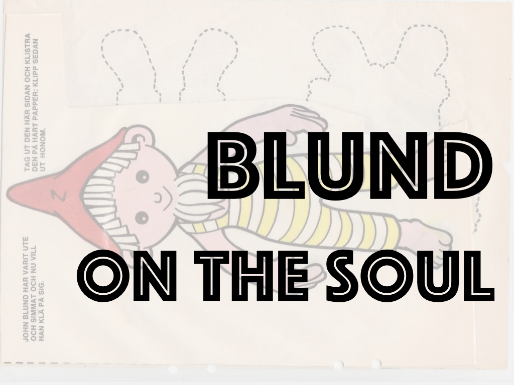

_D. A. Callus and R. W. Hunt (eds): John Blund: Treatise on the Soul. Oxford: Oxford University Press, 2013 (with a new introduction and English translation by Michael W. Dunne (Auctores Britannici Medii Aevi II.) for the British Academy), pp. l, 258. £60 (hb). ISBN 9780197265147_

The volume under review reprints the Latin text of the work _Treatise on the Soul_ (Lat. _Tractatus de Anima_) by the late twelfth-century author John Blund (c.1175–1248), as edited by Daniel Callus and Richard Hunt in 1970.<a id="footnote-1-ref" class="footnote" href="#footnote-1">1</a> It also takes from that work an introduction, and indices of authors, names and keywords. To this it adds a facing English translation and a longer introduction – both prepared by Michael Dunne – and a subject index. An appendix with diagrams and explanations of some of Blund’s technical points is reproduced from the recent German translation (Dorothée Werner, _John Blund. Tractatus de Anima. Traktat über die Seele. Lateinisch-Deutsch_. Freiburg: Herder, 2005).

John Blund’s _Treatise on the Soul_, written before 1204, marks a key transition in the study of natural philosophy, especially psychology, in the high-medieval period. Blund was among the first to bring together the strongly developed twelfth-century Western physiological tradition with insights from Avicenna and Aristotle, and to introduce newly translated works of natural philosophy at Oxford.

Scholarship on Blund has increased since Callus in 1943 rediscovered a manuscript of the _Treatise_ in a miscellany of writings. The current volume draws strongly from existing work. Reprinted here is the introduction from the edition by Callus and Hunt, which provides what was in 1970 the most comprehensive account of Blund’s life, work, and intellectual context. This introduction also details the manuscripts used in establishing the Latin text ((C) Cambridge, St John’s College, MS. 120; (P) Prague, University Library IV D 13 (667); (V) Vatican City, MS. Vat. lat. 833). Much of Dunne’s own, new introduction for this volume relies heavily on Dag Nikolaus Hasse’s work on Blund’s reception of Avicenna’s On the Soul -- one of the most detailed studies on Blund since Callus’ writings (Dag Nikolaus Hasse, _Avicenna’s_ De anima _in the Latin West: The Formation of a Peripatetic Philosophy of the Soul 1160–1300_. London: Warburg Institute, 2000). Still, a student of Blund’s _Treatise_ will find Dunne’s introduction useful, because it brings together much of the current knowledge about this author, his sources, and the audience and nature of the text. It also conveniently summarises its contents.

What does Blund’s _Treatise on the Soul_ offer? Its form is disputative, moving systematically between positions, objections, replies, and solutions. It discusses what the soul is (chaps I–III), and covers the nature of the vegetative (IV–V), sensitive (VI–XXI), and rational (XXII–XXVI) souls and their powers, which includes a discussion of free will (XXVI). A chapter on divine providence (XXVII) is listed in the headings, but is absent from the known manuscripts -- either it is lost, or the work was left unfinished.

Much of what Blund puts forward is traditional. For example, his claim that the soul is a perfection of a body potentially having life (II) comes straight from Aristotle. Further, Blund’s discussion of the various types of souls conforms largely to Avicenna. Blund distinguishes a vegetative soul, which has powers of nutrition, growth, and generation (V); a sensitive soul, which apprehends and causes bodily movement (VI); and an incorporeal, immortal, and essentially simple rational soul (XXII–XXIV). By far the largest portion of Blund’s text concerns the sensitive soul. He details processes of external perception (sight, hearing, smell, taste, and touch) (VIII–XVI), and internal perception (common sense, imagination, estimation, and memory) (XVII–XXI).

At the same time, Blund makes new contributions or adopts an individual stance. For example, the problem of free will he discusses (XXVI) is foreign to Avicenna, and demonstrates Blund’s innovative combination of peripatetic learning with ideas from Anselm. Moreover, against Avicenna, Blund denies that heavenly bodies move voluntarily (I), and that there is such a thing as a world soul (XXV). He equally takes some existing puzzles further, for example, concerning the status of estimation – a power to apprehend the non-sensible properties (‘intentions’) of things (XIX). Though an inner sense power, its high degree of abstraction makes estimation suspiciously similar to intellectual cognition. Blund sharpens this puzzle. He asks: Does the sheep, which apprehends the danger of the wolf, apprehend universals? In favour, he notes that in estimation, the animal seems to apprehend the notions _wolf_ and _danger_, which are universal. But Blund rejects this analysis. All an animal apprehends is that _this wolf_, as it occurs in perception, is dangerous, and that concerns particulars exclusively. Hence estimation can safely count as a sensory power.

To whom might this new publication of Blund’s work be of interest? The contribution that takes it beyond the 1970 volume by Callus and Hunt is the added English translation. This translation will make Blund’s work more easily accessible for non-specialists. Dunne’s translation suits scholarly purposes well. It is careful, precise, and stays close to the original wording and sentence structure of the Latin. This allows the reader to follow Blund’s argumentative moves closely. Divergences appear to aim at simplifying or clarifying the text for the reader. For example, Dunne may shorten the often long Latin sentences, give noun phrases rather than pronouns, or full titles where Blund only gives parts.

The decision to reprint the exact Latin text of the 1970 edition raises questions. Already in a 1972 review, Marvin L. Colker pointed out that the manuscript readings and critical apparatus of this edition contain questionable exclusions, omissions, and oversights (Marvin L. Colker, ‘_Iohannes Blund. Tractatus de Anima_, edited by D.A. Callus and R.W. Hunt’, _Speculum_ 47, no. 1, 1972: 108–10. doi: 10.2307/2851225). Sometimes entire phrases were left out, or alternative readings that directly affect the meaning were not recorded. Colker’s observations, based on manuscript C, have been confirmed by this reviewer. The consequences are clear: the English translation will inherit the gaps or errors from the Latin.

In preparing editions like these, there is always a balancing act between scholarly rigour on the one hand, and timeliness on the other. Further checks will delay the publication of a work that can aid many researchers. However, precisely because these editions can outlast philosophical fashions and form resources for generations of scholars, it is a missed opportunity not to have spent that extra time to verify the Latin.

Overall this is a rich edition. It offers a precise translation, and brings together a range of additional material that will assist and stimulate the developing study of Blund’s work in future years.

#### Notes

1. 
Daniel A. Callus and Richard W. Hunt (eds), <i>Iohannes Blund. Tractatus de Anima</i>, Oxford: Oxford University Press for the British Academy, 1970.<a href="#footnote-1-ref"> ↩</a>