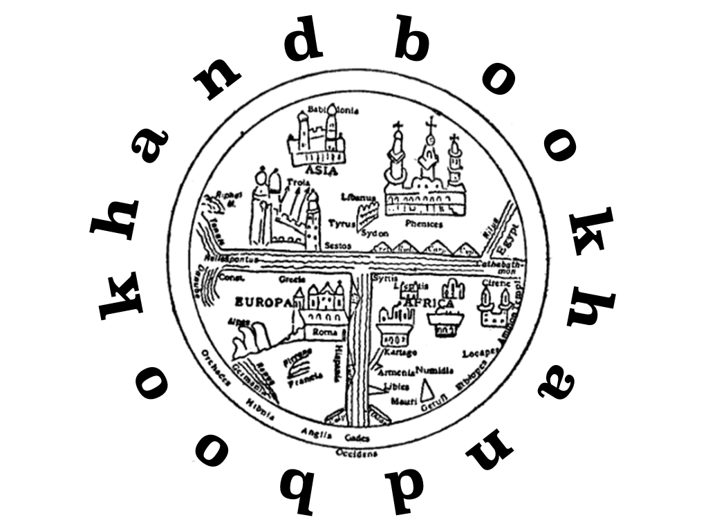

_John Marenbon (ed.): The Oxford Handbook of Medieval Philosophy. Oxford: Oxford University Press, 2012, pp. xii + 768. £95.00 (hb). ISBN 978-0-19-537948-8._

Manifestos sometimes come in disguise. Throughout the pages of _The Oxford Handbook of Medieval Philosophy_, edited by John Marenbon, runs a declaration of policy: contemporary authors working in what gets called the ‘analytical’ tradition should take medieval philosophy seriously. They should take it seriously, because work from the medieval period contains plenty of relevant ideas, methods and arguments that contemporary authors can learn from (3). If we expected our handbook to sit quietly on the shelves merely to inform us about a subject matter, we were wrong.

Another strand in the handbook is a march towards greater inclusiveness. Developing a recent trend in medieval scholarship, part of the handbook sets out to go beyond the typical names and works one may associate with the classification ‘medieval’. Plenty of guides and companions to medieval philosophy are already available, but the aim of inclusive coverage that is also tailored to contemporary interests and preferences marks out this _Oxford Handbook_. It aims to put medieval philosophy on our desks, and to put it there as a whole, rather than piecemeal.

The project of mainstreaming medieval philosophy is still much needed. In many philosophical minds, Aristotle and Descartes are separated by a gaping chasm. Not breaching this chasm is a waste and epistemically irresponsible. If Avicenna was one of the greatest metaphysicians ever alive (as I would suggest he was!), then we are missing out on deep and useful insights by not reading and teaching his work. This handbook targets a contemporary audience that may be in a position to start gap-filling. That’s smart, and it’s urgent.

How does this enterprise take shape in the handbook? The work contains thirty-three chapters, an introduction, and an elaborate index of names and key terms. The chapters are grouped in two parts. There is ‘A Survey of Medieval Philosophy’ (part I), which covers the late ancient background to the medieval period (chap. 1); medieval Greek and Byzantine philosophy (chap. 2); philosophy in the Islamic world, from al-Kindı̄ in the early ninth century up to Averroes (d. 1198) (chaps 3–5); Jewish philosophy in the middle ages (chaps 6–7); and the Latin tradition from roughly the sixth to the sixteenth century and beyond (chaps 8–11). There is also ‘Issues in Medieval Philosophy’ (part II), which consists of four clusters of themes. One cluster focuses on logic and philosophy of language (chaps 12–16); another on metaphysics and epistemology (chaps 17–25); one on normative philosophy (lumping together ‘Moral Psychology, Ethics, Political Philosophy and Aesthetics’, chaps 26–31); and a final cluster on topics in philosophy of religion (chaps 32–33).

What instruction and information can we get from the book? Largely all of the chapters take a head-on scholarly approach. That approach has many faces. Authors may dissect arguments to expose the bone and muscle of positions and disputes. Graham Oppy’s ‘Arguments for the Existence of God’ (chap. 32), for example, goes through a formal assessment of five medieval arguments paired with recent defences. Do not get your hopes up: in the end none of these arguments works, Oppy concludes (702). On other occasions, authors situate their medieval subjects, works and problems by identifying trends in thinking or key sociopolitical events. Thus we hear about the Vandal and Almohad background to twelfth-century Andalusian philosophy (106–7), the rise of rhymed encyclopaedias among post-Maimonedean Jewish thinkers (150–1), and how textual transmission and Christian dogma were not the main factors that prevented radical scepticism from arising among medieval peoples (chap. 25).

We are even led to unedited and unfamiliar texts. Survey chapters repeatedly inform us that crucial works are not yet available in critical editions, are seriously understudied, or may not even have come down to us (35–6, 63, 94, 96, 131, 143–4, 193, 225). Börje Bydén and Katerina Ierodiakonou’s chapter on Greek Philosophy (chap. 2) is particularly heroic on this front. All on its own, it carries the load of representing one of the four traditions studied here – where, for comparison, the Latin tradition gets four. Working through material from fifth century Greece all the way to the fifteenth, it combines a historical overview with careful discussion of systematic topics in logic, epistemology, metaphysics and natural philosophy, all the while dealing with the reality that so much of this material has simply not yet been researched properly.

With scholarly approach come scholarly disputes. Not infrequently, chapters are used to charge other specialists with distorting interpretations or plainly getting things wrong. Gyula Klima’s chapter on ‘Being’ (chap. 18) is an extreme example, as it is entirely devoted to arguing that Anthony Kenny’s work _Aquinas on Being_ (2002) exhibits a ‘failure to master Aquinas’s conceptual idiom’ (405). Such a set-up -- largely an extension Klima’s earlier review of Kenny’s book -- is surprising for a chapter, but conforms to the case-study model that this handbook favours. As such, the work becomes a snapshot of a running discussion, a slice of some current viewpoints; not the last word, but participating in an ongoing march of interpretations and discoveries.

Chapters driven by plots or puzzles can make for particularly good reads. What happened to scholastic learning while seventeenth-century big shots such as Locke and Leibniz took centre stage? (chap. 11) Jacob Schmutz describes how the medieval heritage was transformed and distributed as a result of colonization and missionary activity. Portuguese logic treatises got translated into Mandarin Chinese, and scholasticism permeated the roots of philosophical traditions from Transylvania to Peru. Could, in medieval minds, virtue ethics be combined with natural law? (chap. 28) Yes, it could, argues Terence Irwin, when the precepts of natural law are thought of as helping to identify virtuous actions. Was there such a thing as medieval aesthetics? (chap. 31) Andreas Speer suggests not. Speer aims to undermine the dominant assumption (largely due to Erwin Panofsky) that the objects that medievals spoke of as ‘art’ or as ‘beautiful’ can somehow be meaningfully bundled as objects of aesthetic appreciation.

Here I can only touch on pieces of the banquet of material that this handbook provides. Suffice it to say that if you were not already losing sleep over puzzles such as whether there can be intellectual cognition of particulars, or whether supposition is distinct from signification, these texts can help you get worried. Those who really got hooked may use the bibliographies following each chapter to trace up sources for further study.

While applauding the activism and high standards of this handbook, I do have some concerns about certain aspects of its approach. For there remains something uncomfortable about what is communicated with the overall result – which directly gets us at the broader discussion about how to ‘do’ medieval philosophy. I suggest this has to do with how the project of mainstreaming medieval philosophy is carried out within the scope of a handbook. I will present three points.

First, the inclusiveness of the handbook is restricted. Greek, Arabic, Jewish and Latin traditions cannot count as the main traditions of medieval philosophy, if ‘medieval’ is understood to designate a time frame – roughly, from the third to the seventeenth century. Within that timeframe, there’s a wealth of material in, say, Indian and Chinese philosophy that we are excluding by focusing on just these four. Is this set of four different, because their traditions are systematically intertwined (6)? There are crucial links between Arabic and Indian philosophy too. We end up with the current selection, because we are concerned with what is systematically intertwined with one specific tradition; our starting point is still Latin.

There is another restriction to the inclusiveness. Much of the wealth in fresh authors and works within the four traditions welcomed at the outset evaporates when we reach the ‘Issues’ part of the book. In that part, we by and large fall back on a few big names (Aquinas, Duns Scotus, Ockham, Buridan) in a narrow time span (1250–1350) of only one of the four streams (the Latin one). Flagging this, the editor suggests: ‘This relative narrowness is no accident, but an accurate reflection of the state of the art among the medieval specialists who have the strongest links with contemporary philosophy’ (4). I wonder whether that is right. For what does it mean to have a connection with contemporary philosophy anyway? If it means writing about medieval philosophy in a way that is not too technical, such that the ideas, puzzles and arguments become accessible to a contemporary audience, then I see no reason to regard the pool of specialists as terribly restricted. However, I suspect that ‘having a link with contemporary philosophy’ means something different here. It rather means: writing on topics that are already popular among philosophers whose sources do not predate the twenty-first century.

My two further points concern precisely this selection of topics. The table of contents immediately reveals it: there is much logic, there is much metaphysics. In part this is to be expected, because logic and metaphysics were popular areas of specialization among medieval authors. Still, even if they preferred to start out with these areas, it is not the case that they did not write about other subjects too. It signals a slightly skewed distribution of resources when only one of twenty-two focus chapters is dedicated to political philosophy (chap. 30, on rights) and topics in natural philosophy (other than psychology) are wholly absent. As a reader, I would have found it helpful and refreshing if this selection had been broadened.

Finally, what about the decision to zoom in on philosophical issues that are currently trending? I certainly see how this strategy can be conducive to mainstreaming medieval philosophy, which is one of the two distinctive pillars of this book. Knowing the medieval contributions on a subject matter can deepen and strengthen running discussions. For anyone writing on essence and existence nowadays, it would be madness to ignore Avicenna’s insights on this subject. At the same time, I wonder whether this strategy may also backfire. Say we do put medieval discussions of modality, states of affairs, or intention in the spotlight, because these topics are hot today. What we will find are answers to standing questions that either are the same as or differ, even radically, from our own. It leaves less room for the medieval authors genuinely to surprise us and to shake up our presuppositions about what the relevant philosophical questions and puzzles might be. What does it communicate? That we should take notice of their ideas, methods and arguments, but not too much?

I raise these points not as a final verdict, but rather very much in dialogue with the wider project that _The Oxford Handbook of Medieval Philosophy_ sets out. They come from someone who firmly underwrites the aims of that project, and who admires how that project results in an inviting, scholarly guide to the philosophical labour of several centuries back. That the handbook sparks off such a conversation should be counted as one of its many merits. It is a conversation that may suitably be carried further in future programmatic studies.