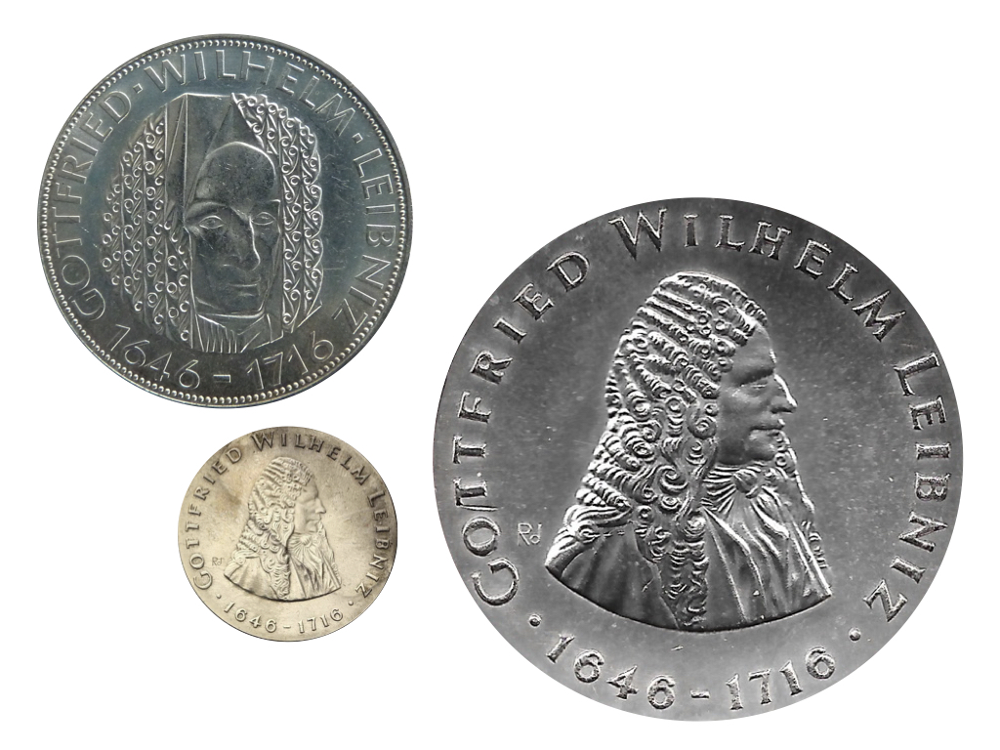

Leibniz’s account of probability has come into better focus over the past decades.<a id="footnote-1-ref" class="footnote" href="#footnote-1">1</a> However, less attention has been paid to a certain domain of application of Leibniz’s account, that is, its application to the moral domain--the sphere of action, choice and practice. This is significant, as Leibniz had things to say about applying probability theory to the moral domain, and thought the matter quite relevant. Leibniz’s work in this area is conducted at a high level of abstraction. It establishes a proof of concept, rather than concrete guidelines for how to apply calculations to specific cases. Still, this abstract material does allow us to begin to construct a framework for thinking about Leibniz’s approach to the ethical side of probability.

Here I will begin by outlining the prominent but contested view of moral probabilism that was available in the sixteenth and seventeenth centuries, as well as Leibniz’s objections to it. Then I will outline Leibniz’s views on how concerns about probability apply to the moral domain. Drawing on the correspondence between Leibniz and the mathematician Jakob Bernoulli (1655–1705), I will also highlight two limits to the former’s view of the application of probability to moral affairs. I conclude that Leibniz enthusiastically supported the expansive use of a ‘logic of chance’, but also saw certain limitations. Let me begin by providing a historical backdrop to Leibniz’s discussion of probability, by laying out an approach that he rejected, namely scholastic moral probabilism.

#### 1. Moral Probabilism

In the sixteenth and seventeenth centuries, there was a significant movement in moral theology, namely that of moral scholastic _probabilism_. Probabilism has its background in sixteenth-century works on conscience, and grew more prominent in the latter half of the seventeenth century, especially in circles where casuistry had a central place.<a id="footnote-2-ref" class="footnote" href="#footnote-2">2</a> Notable proponents are authors such as Honoré Fabri (1608–88), Juan Caramuel y Lobkowitz (1606–82) and Samuel Rachelius (1628–91), among others.<a id="footnote-3-ref" class="footnote" href="#footnote-3">3</a> Probabilism comes in different versions, and developed significantly over the course of the sixteenth and seventeenth centuries. In broad outline, probabilism is a method for decision-making under uncertainty. It is applied when there are multiple conflicting opinions, each supporting different courses of action. How can one act in such case? Probabilism, as the name suggest, is the idea that one ought to determine whether the opinions at issue are probable or not. Probabilism says that it is permissible to follow any opinion that is “probable”. As stated by the influential sixteenth-century author Bartolomé de Medina: “... but that opinion is probable, when wise people assert it, & optimal arguments confirm it”.<a id="footnote-4-ref" class="footnote" href="#footnote-4">4</a> In short, an opinion counts as probable if it is supported by either reason or authority.<a id="footnote-5-ref" class="footnote" href="#footnote-5">5</a>
Consider a schematic example. Suppose you wonder whether it is morally problematic to charge interest on a loan. Let opinion A be that it is morally problematic to charge interest, and opinion B that it is not morally problematic to charge interest. According to scholastic moral probabilism, if only opinion A is probable then it is permissible to follow A; if only B is probable then it is permissible to follow B; if both A and B are probable, then one can permissibly accept either A or B (see: Table 1).

| Doctrine A    | Doctrine B    | Permissible to follow  |
| ------------- | ------------  | :-----:|
| Not probable  | Not probable  | -- |
| Not probable  | Probable      | B |
| Probable | Not probable  |  A |
| Probable | Probable  |  A or B |

_**Table 1** Decision matrix for moral probabilism_

It may be thought surprising that doctrine A and doctrine B can both count as probable, given that they are incompatible. How could it be both morally problematic and not morally problematic to charge interest? Such concern only helps clarify the framework in which these authors operate. Probabilists seek to set out the requirements for practical rationality under conditions of uncertainty. Their framework offers a way of prohibiting the unfounded acceptance of just any doctrine. A doctrine has to be supported by reason or authority for it to be acceptable.<a id="footnote-6-ref" class="footnote" href="#footnote-6">6</a> At the same time, probabilists are not concerned with identifying which position is “right”, or even which is most probable. Their strategy can accommodate a plurality of opinions; a space for reasonable disagreement.<a id="footnote-7-ref" class="footnote" href="#footnote-7">7</a> If both A and B receive support—be it rational or authoritative—that does not mean that both positions are correct. It only means that it is not impermissible to follow either option.

#### 2. Leibniz Rejects Probabilism

In the later seventeenth century, scholastic moral probabilism was critically received, especially in Protestant and Jansenist circles. Antoine Arnauld (1612–94), for example, writes in a treatise from the 1640s against this strand of moral theology of the Jesuits.<a id="footnote-8-ref" class="footnote" href="#footnote-8">8</a> Blaise Pascal (1623–62) mocks moral probabilism in his pseudonymously published _Provincial Letters_ (published 1656–7).<a id="footnote-9-ref" class="footnote" href="#footnote-9">9</a> The key objections made against scholastic probabilism are twofold. First, one major concern is that probabilism will end up being too permissive, such that it will lead to a lax morality. To understand why this may be so, suppose that you contemplate committing fraud. The idea is that you will always be able to find some reason or some authority that permits fraudulence, hence rendering this opinion “probable”, and thereby permissible. It looks as though, by the lights of probabilism, practically all kinds of behaviour can be rendered permissible. This great permissiveness made probabilism an objectionable approach to moral decision-making.

A second concern, perhaps even more troubling from a theoretical perspective, is that probabilism counts views as probable on the wrong sort of grounds. Say that you consider lying to someone. Is it permissible to do so? According to probabilism, that depends on whether some reason or authority supports it. But strictly, whether something or someone supports it is wholly extrinsic to the phenomenon under consideration, namely that of lying.<a id="footnote-10-ref" class="footnote" href="#footnote-10">10</a> When someone wants to determine whether a certain course of action is permissible, why would it even be relevant to consider whether some authority (or reason) supported it?

Leibniz shares these concerns. This is a prominent subject in Leibniz’s correspondence with Landgrave Ernst of Hessen-Rheinfels in the early 1690s. For example, in some of these letters Leibniz speaks of “... that strange opinion of the casuists, who maintain against the eternal laws of good sense, that in practice one can follow that opinion, which one knows to be less certain and less probable”.<a id="footnote-11-ref" class="footnote" href="#footnote-11">11</a> On the face of it, Leibniz may seem to be missing the point here, as probabilism recommends following an opinion that is probable, not that one can follow a less probable opinion. However, Leibniz’s concern, I take it, is that the structure of permissibility that probabilism recommends allows for opinions to be followed that one understands—that is, bracketing the probabilist’s technical definition— to be less probable. One finds Leibniz make a like move elsewhere:

> (...) the opinion of people whose authority is weighty is one of the things which can contribute to rendering an opinion likely (_vraisemblable_), but it is not what produces all the likelihood (_vérisimilitude_). And while Copernicus was almost alone in his opinion, it was still incomparably more likely (_vraisemblable_) than that of all the rest of the human race.<a id="footnote-12-ref" class="footnote" href="#footnote-12">12</a>

According to Leibniz, heliocentrism was in fact more, and geocentrism less, likely to be true, even though authorities in the mid-sixteenth century showed greater support for the latter than for the former. Probabilism, however, cannot capture how there could be degrees of likelihood independent of support by reason or authority.

That Leibniz cautions against moral probabilism need not be too surprising, given that he has said that it would condone practical actions that go against the eternal laws of good sense. In his correspondence with Landgrave Ernst, Leibniz sometimes classifies probabilism as dangerous: “... if it were not for the Protestants and the so called Jansenists and their sort ... the highly damaging probabilism would have become dominant”.<a id="footnote-13-ref" class="footnote" href="#footnote-13">13</a> Hence Leibniz thinks that moral probabilism will have damaging consequences.

Further, Leibniz also voices the second concern mentioned above. He suggests that probabilism elevates opinions to the status of being “probable” (and hence permissible) on the wrong grounds. For example, in his _Nouveaux Essais sur l’entendement humain_ (_New Essays on Human Understanding_, 1703–5), Leibniz writes, via his mouthpiece Théophile:

> (...) the majority of the casuists who have written on probability have not understood its nature, founding it on authority like Aristotle, instead of founding it on likelihood as they ought to. Authority is not among the reasons that found likelihood (_vraisemblance_).<a id="footnote-14-ref" class="footnote" href="#footnote-14">14</a>

Leibniz is not uniformly negative about casuistry.<a id="footnote-15-ref" class="footnote" href="#footnote-15">15</a> Nor does he resist in principle the idea of considering probability in the ethical domain. Rather, Leibniz holds that the particular approach to probability offered in scholastic moral probabilism is harmful and misguided. As he recounts: “The default of the lax moralists in this article has been, to a large extent, to have a very limited and highly inadequate notion of the probable (_probable_).”<a id="footnote-16-ref" class="footnote" href="#footnote-16">16</a> In the next sections, I will outline Leibniz’s positive account of probability, and show how he takes it to be of use in the moral domain.

#### 3. Leibniz on Probability

Leibniz discusses probability in a host of writings, ranging from his youthful studies on law and jurisprudence, to his mathematical texts, various correspondences, and his late work the _Theodicée_ (_Theodicy_).<a id="footnote-17-ref" class="footnote" href="#footnote-17">17</a> In line with his objections to probabilism, Leibniz emphasizes more than once that in considering probability, one needs to be concerned with its foundation in the phenomena themselves. This comes up explicitly in a range of texts, for example in his work on a general science from the mid-1680s, in which Leibniz says that probability is “drawn from the nature of things in proportion to what one can know, and what one can call the likelihood”.<a id="footnote-18-ref" class="footnote" href="#footnote-18">18</a> It also comes up in Leibniz’s response to Locke on probability. For example, in the _Nouveaux Essais_, immediately after Leibniz has again rejected scholastic probabilism, he continues by stating that:

> (...) the probable is broader: one must draw it from the nature of things; and the opinion of people whose authority is weighty, is one of the things that may contribute in rendering an opinion plausible, but it is not what establishes all the likelihood.<a id="footnote-19-ref" class="footnote" href="#footnote-19">19</a>

The core point for Leibniz is that if a certain proposition is probable, then it has a certain likelihood or tendency of being true. This contrasts with, for example, the idea that if a proposition is probable, then there is certain testimonial support for it (as moral probabilists would have it), or that the subject would have a certain degree of belief in the proposition (as is more akin to a Bayesian approach). But for Leibniz, then, the phenomena captured in a probable proposition will have a certain likelihood or tendency of being the case. Conjectures or estimates are to be founded precisely on this: knowledge of how easy (_facile_) or feasible (_faisable_) it is for certain outcomes to be realized. Leibniz gives the example of the throw of dice. It is equally easy, he says, to throw twelve as it is to throw eleven, as both can be thrown only in one way. But it is three times easier to throw seven, as it can be thrown in three different ways.<a id="footnote-20-ref" class="footnote" href="#footnote-20">20</a> Here Leibniz errs in counting the combinations in this specific example. In fact, it is twice as easy to throw eleven than it is to throw twelve, and six times easier to throw seven than twelve.<a id="footnote-21-ref" class="footnote" href="#footnote-21">21</a> But this does not take away the fact that Leibniz may be correct in the spirit of his assessment: the likelihood of the truth of the proposition that I will throw twelve may very well be based in the likelihood of my throwing twelve.

Leibniz identifies a foundation for probabilities that lies with things out there in the world, and the ease or tendency for certain outcomes to be realized. Hence, Leibniz firmly views probability as an objective feature of the world.<a id="footnote-22-ref" class="footnote" href="#footnote-22">22</a> (In contemporary terminology, we can say Leibniz gives an “objective” interpretation of probability. However, in Leibniz’s thinking this converges with a logical interpretation, as I will describe below.<a id="footnote-23-ref" class="footnote" href="#footnote-23">23</a> Leibniz moreover takes these objective probabilities to be reflected in our cognition, or our degrees of knowledge.) Leibniz strongly resists the idea that probability is something subjective, having to do with the degree to which we can be certain of an outcome:

> Consider however (imitating Mathematicians) certainty or truth to be like the whole; & probabilities [to be like] parts, such that probabilities would be to truths what an acute angle [is] to a right [angle].<a id="footnote-24-ref" class="footnote" href="#footnote-24">24</a>

Leibniz emphasizes this in the short text _De incerti aestimatione_ (_On the estimation of the uncertain_), written in 1676 during his stay in Paris, in which he treats degrees of probability as having to do not so much with uncertainty, but with the nature of objects. He states: “Probability is the degree of possibility (_gradus possibilitatis_)”, that is, the degree to which a certain thing can be realized.<a id="footnote-25-ref" class="footnote" href="#footnote-25">25</a>

How does one study such objective probabilities? Leibniz regards the scientific investigation of probability as a branch of logic.<a id="footnote-26-ref" class="footnote" href="#footnote-26">26</a> Determining probabilities is conducted _a priori_, by assessing the likelihoods of a range of possible outcomes.<a id="footnote-27-ref" class="footnote" href="#footnote-27">27</a> Having an _a priori_ character is compatible with being a science; just think of mathematics, which is often understood as the science of number, quantity and space. It is moreover compatible with being applied to concrete worldly cases. For while calculations of probability are conducted _a priori_, Leibniz does take them to reflect actual ratios and tendencies out there in the world. Especially later on in his work, he becomes sensitive to how statistical information can be of use in assessing such ratios. (Though he does see limitations, as will be discussed later on.) A logic of chance would help assess the relations between propositions that are probable, and describe the types of inferences one can draw or arguments one can make on that basis.<a id="footnote-28-ref" class="footnote" href="#footnote-28">28</a> Leibniz takes a logic of probability to contrast with, and to complement a standard logic dealing with demonstration and deductive inferences. For example, in the _Theodicée_ Leibniz contrasts probable arguments with conclusive ones, and probable reasons with demonstrations. Probability logic, he suggests, would be “a kind of logic which should determine the balance between probabilities” and should be used “when we pass beyond necessary arguments”.<a id="footnote-29-ref" class="footnote" href="#footnote-29">29</a> Further, in his _Præcognita ad encyclopediam sive scientiam universalem_ (Forethoughts for an encyclopaedia or universal science_), Leibniz contrasts propositions which are certain of themselves with those that are probable. He states:

> Probability, however, is not something absolute, [it is] drawn from certain information which, although it does not suffice to resolve the problem, nevertheless ensures that we judge correctly which of the two opposites is the easiest (_facilius_) given the conditions known to us.<a id="footnote-30-ref" class="footnote" href="#footnote-30">30</a>

In short, it is the type of investigation we use for all cases in which we deal with inconclusive, non-demonstrative evidence.

Leibniz regards logic as the “art of thinking”, which forms part of a universal science that includes inquiries into varied branches of study, such as physics, mathematics, as well as political, economic and other forms of inquiry.<a id="footnote-31-ref" class="footnote" href="#footnote-31">31</a> Hence he views the study of probability as continuous with mathematical and scientific inquiry more generally. However, he also notes that as things stand in his time, this logic has not yet been developed. In a text from 1678–9, he notes: “And so, among other things, I work on a certain part of logic, thus far almost not touched on, about estimating degrees of probability and the balance of proofs, presumptions, conjectures and indications.”<a id="footnote-32-ref" class="footnote" href="#footnote-32">32</a> Among other places, in a letter from the late 1680s to Antoine Arnauld, Leibniz suggests that calculations of the probable will be very useful, but remain to be worked out.<a id="footnote-33-ref" class="footnote" href="#footnote-33">33</a> Let this stand as an outline of Leibniz’s approach to probability.

How does Leibniz take probability thus understood to apply to moral matters? Before answering that question, let me map out how Leibniz conceives of the moral domain.

#### 4. Moral Affairs

Several of Leibniz’s writings bear on moral questions, broadly understood.<a id="footnote-34-ref" class="footnote" href="#footnote-34">34</a> Many of his interests are meta-ethical in character, often having a legal or juridical slant, reflecting Leibniz’s background and training in law. Instances of Leibniz’s works on moral questions are early works such as those on conditions, jurisprudence and natural law, as well as later work such as texts on the concept of justice, his response to the work of Samuel V and of course, as always, his correspondences.<a id="footnote-35-ref" class="footnote" href="#footnote-35">35</a>

Ethics, in Leibniz’s conception, concerns the practical domain, that is, the domain of choice and action, which includes questions about how to live well. Here we are concerned with what is right and what is good, or more specifically, with what is permissible or not permissible, obligatory or not obligatory, and so on. It becomes clear that Leibniz has a broad, inclusive conception of the moral domain as encompassing the more general notion of justice.<a id="footnote-36-ref" class="footnote" href="#footnote-36">36</a> Normatively, Leibniz’s position cannot be neatly moulded into contemporary ethical categories. In broad terms, he comes close to what today would be labelled a consequentialist ethics, in which the focus is on achieving good outcomes. But it would be a sophisticated consequentialism, which bases a concern with outcomes in a framework of the rights and duties of rational substances.<a id="footnote-37-ref" class="footnote" href="#footnote-37">37</a> Ultimately, the main concern in matters of morality for Leibniz is with overall felicity and well-being.

As an adherent of natural law, Leibniz holds there to be a core set of ethical notions and principles to guide all human conduct.<a id="footnote-38-ref" class="footnote" href="#footnote-38">38</a> These principles are objective, natural and eternal. Crucially, they are also fundamentally rational. We may already have an instinctive grasp of notions such as happiness, love, justice and obligation through our natural responses of conscience. However, in principle they can all be rationally formulated, explicated and demonstrated.<a id="footnote-39-ref" class="footnote" href="#footnote-39">39</a> The aim of such investigation is to determine which actions are good or bad, just or unjust, permissible or obligatory, and so on.

That Leibniz regards the scientific investigation of these fundamental principles as an _a priori_ practice is already clear from his _Nova methodus discendae docendaeque jurisprudentiae_ (_New method for learning and teaching jurisprudence_, 1667), where he proposes to reform methods of jurisprudence by modelling them on geometrical, Euclidean procedures—starting with definitions, and deducing a range of precepts from them (precepts are to include those such as “harm no one”, ”give each their due” and “live honourably”).<a id="footnote-40-ref" class="footnote" href="#footnote-40">40</a> In another work, _Elementa juris naturalis_ (_Elements of natural law_, 1671–2), Leibniz states:

> The doctrine of right is counted among those things, which do not depend on experience, but on definitions, not on sense, but on demonstrations of reason; and they are, so to say, matters of right and not of fact. For when justice consists in some form of congruity and proportionality, we can understand something to be just, even if there is no one who so counts it or is counted, and it is possible to predict that a house, a machine, a republic would be beautiful, effective, or happy, if it were to be in the future, even if that future never came to be.<a id="footnote-41-ref" class="footnote" href="#footnote-41">41</a>

The thought is that the investigation into what is good and right ought to be focused on establishing proofs in understanding.<a id="footnote-42-ref" class="footnote" href="#footnote-42">42</a> For individuals conducting such investigation, it can ultimately contribute to moral development, and so to the attainment of happiness and perfection.

Given this account of the moral domain, how does Leibniz take the study of probability to be of relevance here? In the next section, I will give an overview of Leibniz’s conception of probability as applied to morality.

#### 5. Probability in Moral Affairs

Here is a schematic reconstruction of how Leibniz appears to consider the relevance of probability in the moral domain (Leibniz does not explicitly give this argumentative structure. Rather, it figures implicitly in the background of some of his discussions):

1. The study of probability allows one to better assess cases that involve probable arguments.
2. Probable notions and arguments figure in numerous cases of moral reasoning.
3. The study of probability allows one to better assess numerous cases of moral reasoning.

In the foregoing, I have established that Leibniz accepts the first premise. That he also endorses the second is clear from various texts. For example, in a short tract from 1670 on the foundations of law, Leibniz states:

> Probable argumentation proceeds from the nature of a thing or from human opinion. From the nature of a thing in turn comes either _presumption_ or _conjecture_. It is presumption when the proposed statement results necessarily from manifest truths, with nothing preventing it. A judgement ought then always be rendered in favour of those who have the presumption going for them, except when an adversary demonstrates the contrary. Such is the majority of reasoning in morality.<a id="footnote-43-ref" class="footnote" href="#footnote-43">43</a>

Here Leibniz clarifies that most of the reasoning about morality is probable argumentation of the sort that can be called “presumption”, namely probable arguments proceeding from the nature of a thing. Other texts from 1677–8 directly contrast considerations about the practical conduct of life—including concerns about right ways to act—with demonstrative reasoning.<a id="footnote-44-ref" class="footnote" href="#footnote-44">44</a> These works support the idea that Leibniz would indeed also embrace the second premise.

Leibniz equally accepts the conclusion of the argument. In general, Leibniz saw great merit in approaching ethical questions with the same rigour as is commonplace in geometry or mathematics. The belief that scientific inquiry can help advance human well-being is apparent from many of the titles of texts belonging to his project of developing a universal science, which Leibniz says aim at human happiness (_ad humanam felicitatem_ or _ad publicam felicitatem_).<a id="footnote-45-ref" class="footnote" href="#footnote-45">45</a> Given that Leibniz envisages a logic of probability to be part of this universal science, then to the extent that instances of this science advance well-being, so too does the science of probability. Further, it also stands out in explicit statements. For example, in one of his studies towards a universal science, Leibniz comments on the usefulness of probability in practice:

> Even when it concerns nothing but probabilities, one can always determine that which is most likely _ex datis_. It is true that this part of the useful logic is not yet found anywhere, but it would be of wonderful use in practice, when it concerns presumptions, indications and conjectures, to know the degrees of probability, when there is a quantity of reasons apparent both on the one and the other side in an important deliberation.<a id="footnote-46-ref" class="footnote" href="#footnote-46">46</a>

The above suggests that moral and practical considerations are connected. Such a tie would fit well with the point, presented earlier, that Leibniz works with a broad, inclusive notion of the moral sphere (concerning questions about what is right, deliberation over what is good, and generally what affects the balance of goodness and well-being). Not everything that Leibniz considers part of morality is what we would nowadays identify as concrete moral dilemmas (such as trolley problems); an overlap between morality and practice does not come with such a restriction. But there is a reasonable ground for thinking that even if Leibniz does not regard the practical and the moral as strictly identical, he treats them as broadly overlapping domains.

How would Leibniz’s sketched approach to probability in the moral sphere be applicable to more concrete cases of moral decision-making? As stated, Leibniz only developed his position on the application of probability in the moral domain at a high level of abstraction. His remarks on this subject available to us stay largely programmatic and anticipatory, instead of focused on actual case studies. Nevertheless, it is still possible to identify the outlines of his stance towards actual examples contained in his discussion. Here I will discuss two of these, suggested in passing by Leibniz himself. The first concerns what we would now identify as distributive justice; the second concerns what is today known as the field of decision theory.

One area in which Leibniz’s stance is indirectly shaped by his thinking about probability—-in particular about games of chance-—is in considerations about justice, such as questions of just distribution. At points Leibniz suggests a principle of distribution, according to which a good is to be distributed in proportion to the likelihood of the claim that each of the claimants makes to that good. In a 1687 letter to the German jurist Vincent Placcius (1642–99) he writes:

> For example, if persons _L_ and _M_ both lay claim to a sum of 30 on the same legal grounds, and neither [of them] held it in their possession over the other, nor is to be preferred on another [legal] ground, and his [_M_’s] claim is twice as probable [than _L_’s], truly this law is to be employed; natural justice, I say, would be that a proportional division is to be made between them.<a id="footnote-47-ref" class="footnote" href="#footnote-47">47</a>

And in the _Nouveaux Essais_, he describes how agricultural labourers in Lower Saxony apply a method of taking the arithmetic mean between several equally probable hypotheses about the value of a certain good:

> For example, when some inheritance or land is to be sold, they create three groups of assessors ... and each group assesses the commodity in question. Suppose then that the one estimates it at the value of 1000 crowns, the other at 1400, the third at 1500; one takes the sum of the three estimates, which is 3900, and because there were three groups, one takes a third of this, which is 1300 for the mean value sought; or, which is the same thing, one takes the sum of one third of each estimate. This is the axiom: _aequalibus aequalia_, for like hypotheses one must have like consideration. But when the hypotheses are unlike, one compares them with another.<a id="footnote-48-ref" class="footnote" href="#footnote-48">48</a>

A common line in these cases is the idea that equally probable claims are to be given proportional consideration. At the same time, the precise thoughts here differ. In the one instance it concerns how such proportional weight comes in with the distribution of a good to which multiple parties lay a claim, whereas in the other instance it is used to help identify the value of a good (without assuming that any of the assessors would lay a claim to it). Hence it is not clear that Leibniz advances a single, uniform principle of distributive justice here (although he has been interpreted in that way).<a id="footnote-49-ref" class="footnote" href="#footnote-49">49</a> What is clear, however, is that Leibniz explores ways of distributing goods and weighing of evidence that could form the basis of such a principle.

A different example shows Leibniz moving in the direction of decision theory. In his _Elements of Natural Law_, after having criticized a competing view, Leibniz tries out the following:

> Then finally, therefore, probabilities are to be followed, when the ratio of the probable effects is greater than [that of ] the reciprocal, or if it is much more probable for act A to have a better effect than B, than for B [to be better] than A. Or if the product of the multiplication of the probability with goodness is greater with A than [with] B. Let the probability of A be 5, its goodness 4. The product would be 20. Let the probability of B be 6, [its] goodness 3, the product would be 18. Therefore it would be better to follow A rather than B, even if it is less probable.<a id="footnote-50-ref" class="footnote" href="#footnote-50">50</a>

Act A could for example be the act of charging interest on one’s loan, and B the act of charging a fixed service fee for providing the loan. We can schematize this as shown in Table 2.

|   | Probability  | Quality  | Product  |
| ----- | :-----: | :-----:| :-----:|
| Act A | 5  | 4 | 20 |
| Act B | 6  | 3 | 18  |

_**Table 2** Competing courses of action (Leibniz)_

Here I take it that Leibniz understands the probability of an act as the probability of a certain outcome associated with that act occurring (not the probability of the act itself occurring). It is, roughly, the probability that the act will be successful. On Leibniz’s proposal, in the current case the optimal course of action would be act A, because its product of probability and quality is greatest.<a id="footnote-51-ref" class="footnote" href="#footnote-51">51</a>

Leibniz applies a probability calculation to determine optimal courses of action.<a id="footnote-52-ref" class="footnote" href="#footnote-52">52</a> This has a moral dimension, given that we include in this calculation an assessment of the respective goodness of each of these acts. Assessing an act’s probability hence can give people a tool in determining how to act, and so can help them make moral choices. There are straightforward difficulties with what Leibniz carves out here. For one thing, where do the numbers come from? That is, how do we determine that act A has a quality of 4 and act B of 5? Further, it is an act with minimal quality but very high probability that could get a score equal to or higher than an act with a high quality but low probability. But does that really mean that it would be a better choice? The schematic, exploratory character of his work here prevents Leibniz from directly addressing these or similar issues.

Might there be cases where calculations of probability would not be useful to moral decision-making? Of course there are. As indicated, Leibniz understands assessments of probability to contrast with, and complement, any form of reasoning which involves demonstration or concerns necessary truths. When dealing with necessities, there remains no need to calculate probable outcomes. This general principle about the usefulness of probability assessments holds generally, and so also in the sub-domain of morality.

The approach to probability that Leibniz advances here differs from the scholastic moral probabilist account as discussed earlier. Probabilism deems an action probable, and therefore permissible, purely on the basis of external support for that course of action, either by reason or by a weighty authority. That is what Leibniz rejects. In the above example, Leibniz uses the intrinsic features of an act’s probability (understood as the ease or facility of resulting in a certain outcome) and its quality to identify the optimal choice. It is an attempt at introducing mathematics, and therewith measures of degrees, into moral affairs.

When probability theory was nascent in the late seventeenth century, Leibniz was one of the few who explicitly sought to apply assessments of probability to the moral domain. Most other investigations into uses of probability in this period concentrated on mathematical puzzles, in particular relating to games of chance, insurance and annuities. This is precisely the sort of material that Leibniz got acquainted with during his stay in Paris (1672–6), when studying the work of Pierre de Fermat (1601–65), Blaise Pascal (1623–62) and Christiaan Huygens (1629–95). The fact that Leibniz sought to extend the uses of probability beyond the purely mathematical makes him something of a pioneer on this line of inquiry.

He was not the only one, however. Another person concerned with the moral side of probability was the mathematician Jakob Bernoulli (1654–1705), with whom Leibniz corresponded for some time. Bernoulli was one of the few who, like Leibniz, envisaged the application of probability calculations to ethical cases. The exchange between Bernoulli and Leibniz in the early 1700s helps to bring out some of the limits Leibniz conceived in the application of probability theory to ethics.

#### 6. Limits of Probability

Leibniz had maintained an active correspondence with members of the Bernoulli family since the late 1690s. In April 1703 Leibniz writes to Jakob Bernoulli. In the postscript of his letter, Leibniz says that he has heard that Bernoulli has been working on estimating likelihoods, and that he would like to see all of Bernoulli’s work. Their discussion of probability unfolds from there. In the course of this discussion, two points of divergence between the two authors stand out. One of these differences concerns the extent of the use of probability with respect to practical affairs. Is the calculation of probabilities about moral cases always most useful? Bernoulli strongly believed it was. He announced that he would devote the entire last part of his book in progress--published posthumously in 1713 as _Ars conjectandi_ (_The art of conjecturing_)--to “how to apply the principles of the art of estimation to civil, moral, and economic affairs”.<a id="footnote-53-ref" class="footnote" href="#footnote-53">53</a> When Bernoulli mentions his plan to Leibniz, the latter responds with encouragement as well as some reservation:

> The estimation of probabilities is extremely useful, although in several political and legal situations there is not as much need for fine calculation as there is for the accurate recapitulation of all the circumstances.<a id="footnote-54-ref" class="footnote" href="#footnote-54">54</a>

This signals one limit Leibniz saw in the use of probability theory in the practical domain. While he evidently regards it as relevant, he does not assume that it is appropriate in all cases. Sometimes it is more urgent to get the facts right.

A second point of divergence arises when Bernoulli presents Leibniz with a puzzle that the former has been thinking about for a while. Bernoulli’s puzzle is: How much more probable is it for a twenty-year-old to survive a sixty-year-old, than vice versa?<a id="footnote-55-ref" class="footnote" href="#footnote-55">55</a> Here Bernoulli asks about the ratio of twenty-year-olds who survive sixty-year-olds, or the probability of the one surviving the other. In response to his own puzzle, Bernoulli makes a suggestion:

> For had I observed it to have happened that a young man outlived his respective old man in one thousand cases, for example, and to have happened otherwise only five hundred times, I could safely enough conclude that it is twice as probable that a young man outlives an old man as it is that the latter outlives the former.<a id="footnote-56-ref" class="footnote" href="#footnote-56">56</a>

That is, Bernoulli optimistically suggests that, with enough observations, one can get to the true ratio or probability with ever increasing precision.<a id="footnote-57-ref" class="footnote" href="#footnote-57">57</a> If, in idealized conditions, the number of observations could extend to infinity, then one could be certain of that figure.<a id="footnote-58-ref" class="footnote" href="#footnote-58">58</a> (In practice, Bernoulli suggest that if a hundred or thousand observations confirm the same ratio, this suffices for being morally certain of the correctness of that ratio.<a id="footnote-59-ref" class="footnote" href="#footnote-59">59</a>) In short, the thought is that the chance of an accurate ratio increases steadily as the number of observations grows, so that one can in principle investigate the ratio between the numbers of possible outcomes _a posteriori_ with as much certainty as when one investigates _a priori_.<a id="footnote-60-ref" class="footnote" href="#footnote-60">60</a> Leibniz disagrees:

> When we estimate empirically, by means of experiments, the probabilities of successes, you ask whether a perfect estimation can be finally obtained in this manner. You write that you have found this to be so. There appears to me to be a difficulty in this conclusion: that happenings which depend upon an infinite number of cases cannot be determined by a finite number of experiments; indeed, nature has her own habits, born from the return of causes, but only ‘in general’.<a id="footnote-61-ref" class="footnote" href="#footnote-61">61</a>

Leibniz points out that actual observations will always be finite in number, as one cannot ever make an infinite number of them. Hence, on the basis of observation will always be finite in number, one cannot ever get to genuine certainty.<a id="footnote-62-ref" class="footnote" href="#footnote-62">62</a> This disagreement ties in with, but is not a strict result of, Leibniz’s earlier mentioned view that the study of probability is a branch of logic, conducted _a priori_. Indeed, it comes up in the context of drawing inferences on the basis of observations. But Bernoulli and Leibniz disagree not over whether inferences from statistical data are ever legitimate or not. Both Bernoulli and Leibniz agree that they are. Their dispute concerns the epistemic outcome of such inferences; whether this can indeed be one of certainty (Bernoulli’s view), or whether it will be restricted to high confidence based on repeated confirmation (Leibniz’s view).

This, then, constitutes another core difference between the two authors. Moreover, it indicates a further limit to Leibniz’s stance towards the use of probability in the moral domain. He did not think that one could ever get certainty on the basis of empirical observations, that is, from statistical data. Given that the two limits brought out here are general limits to the use of probability, they will equally hold for the application of probability to moral affairs, such as when we are considering just distributions or deliberating between competing courses of action. Hence according to Leibniz, in the moral domain too it will sometimes be more relevant to get the facts right than to proceed with potentially complicated calculations, and we cannot get to certainty about ratios on the basis of statistical data.

#### 7. Conclusion

The framework for thinking about Leibniz on the use of probability in the moral domain that I have developed here is as follows. Leibniz rejects a version of scholastic moral probabilism, according to which whether something is probable depends on its being supported by external factors, namely by reason or authority. Instead, Leibniz captures probability as an objective feature of things in the world, and is a strong proponent of applying that conception of probability to the moral domain, inclusively understood. Calculations of probability can assist when deciding about actions concerned with what is good or bad, permissible or impermissible, or obligatory or not. Ultimately, he takes this application of the science of probability to contribute to advancing human well-being.

At the same time, I have also shown that Leibniz did see limits to the application of probability theory in the moral domain. First, he believes that calculating probabilities is not the most useful thing to do in all cases; getting the facts right may prove more crucial. Second, unlike Bernoulli, he holds that one can never, not even in principle, get certainty about likelihoods based on empirical data.<a id="footnote-63-ref" class="footnote" href="#footnote-63">63</a>

#### Notes

1. 
Gerhardt, “Leibniz und Pascal”; Couturat, _La Logique de Leibniz_, esp. chap. VI.28; Keynes, _A Treatise on Probability_; Hacking, “The Leibniz-Carnap program for inductive logic”; Hacking, _The Emergence of Probability_; Knecht, _La Logique chez Leibniz_, esp. chap. VII.5; Daston, _Classical Probability in the Enlightenment_.<a href="#footnote-1-ref"> ↩</a>
2. 
For more detailed background discussions, see: Bellhouse, “Probability in the sixteenth and seventeenth centuries”; Jonsen and Toulmin _The Abuse of Casuistry_; Keenan and Shannon, _The Context of Casuistry_; Schüssler, “Scholastic probability as rational assertability” and “The anatomy of probabilism”; and Braun and Vallance, _Contexts of Conscience in Early Modern Europe, 1500–1750_.<a href="#footnote-2-ref"> ↩</a>
3. 
Some instances of central works in this period are: Lessius, _De justitia et jure caeterisque virtutibus cardinalibus libri quatuor_ (1609); Fabri, _Pithanophilus seu dialogus_ (1659); Lobkowitz, _Apologema pro antiquissima doctrina de probabilitate_ (1663); Rachelius, _Examen probabilitatis qvam jesuitae novique casuistae theologiae suae moralis fundamentum constituerunt_ (1664).<a href="#footnote-3-ref"> ↩</a>
4. 
In: Medina, _Expositio in primam secundae angelici doctoris d. Thomae Aquinatis_ (1580), q. 19, art. 6, 179. I read Medina here as giving two sufficient conditions, not two necessary and jointly sufficient conditions (that is, something is probable when supported by reason; something can also probable when it is supported by authority).<a href="#footnote-4-ref"> ↩</a>
5. 
Alternative positions in the same spirit are “probabiliorism” (the view that one ought to follow what is more probable) and “tutiorism” (the view that one ought to follow what is least risky). Here I will focus on probabilism, given that this is most central as a background for Leibniz’s work.<a href="#footnote-5-ref"> ↩</a>
6. 
As Rudolf Schüssler has brought out in recent work (esp. Schüssler, “Scholastic Probability as Rational Assertability”), the framework within which to understand the probabilistic method is one motivated by a concern about the grounds of testimony, as well as about creating a baseline for rational assertability.<a href="#footnote-6-ref"> ↩</a>
7. 
Schüssler (“Scholastic Probability as Rational Assertability”, esp. 210ff., 217) also discusses how a central motivation for Medina was to find ways of bracketing one’s personal opinion to accommodate a pluralism of opinions, and the possibility of reasonable disagreement among individuals.<a href="#footnote-7-ref"> ↩</a>
8. 
Arnauld writes about the proposition “The authority of a good and learned doctor renders an opinion probable”: “This proposition is pernicious, & introduces an infinity of absurdities in all matters of moral doctrine” (my translation). Arnauld, _La théologie morale des Jésuites, et nouveaux casuistes_ (1644), prop. XXVI.<a href="#footnote-8-ref"> ↩</a>
9. 
In: Louis de Montalte (= Blaise Pascal), _Les provinciales ou Lettres escrites par Louis Montalte a un Provincial de ses amis, & aux RR. PP. Jesuites: Sur la Morale & la Politique de ces Peres_. A statement in the middle of the sixth letter portrays probabilism as nothing but a sheepish route to work away contradictions between statements from various church authorities. One of the interlocutors says: “You now see how, either by the interpretation of terms, by the observation of favourable circumstances, or by the aid of the double probability of pro and con, we always contrive to reconcile those seeming contradictions which occasioned you so much surprise, without ever touching on the decisions of Scripture, councils, or popes.”<a href="#footnote-9-ref"> ↩</a>
10. 
Hacking, _The Emergence of Probability_, chap. 4, gives an extended discussion of the development of intrinsic as opposed to extrinsic conceptions of the probability of an event.<a href="#footnote-10-ref"> ↩</a>
11. 
A I 7, 230.<a href="#footnote-11-ref"> ↩</a> 
12. 
NE 372–3.<a href="#footnote-12-ref"> ↩</a>
13. 
A I 7, 302.<a href="#footnote-13-ref"> ↩</a>
14. 
NE 206.<a href="#footnote-14-ref"> ↩</a>
15. 
One example of this is how in _Dialogue between Poliander and Theophile_ (c.1678), Poliander suggests that whatever the shortfalls of the casuists’ position, their work does have its merits in getting people to practise Christian virtues (LGR 145).<a href="#footnote-15-ref"> ↩</a>
16. 
NE 372.<a href="#footnote-16-ref"> ↩</a>
17. 
Some relevant texts by Leibniz touching on probability are: _De conditionibus_ (_On conditions_) (1665) (A VI 1, 97–150); _Dissertatio de arte combinatoria_ (_Dissertation on the art of combinations_) (1666) (A VI 1, 163–230); shorter tracts on games of chance, annuities, and the estimation of the uncertain in the 1670s and 1680s; the project of developing a universal science (_scientia generalis_) (A VI 4 contains hundreds of distinct texts contributing to this project); _Nouveaux Essais_; _Theodicée_ (_Theodicy_); his correspondence with Landgrave Ernst of Hessen-Rheinfels in the 1690s, and with Jakob Bernoulli in the early 1700s. A relevant selection of Leibniz’s shorter texts dealing with chance and probability has been published in French by Marc Parmentier as _L’estime de l’incertain_ (in his _L’estime des apparances_).<a href="#footnote-17-ref"> ↩</a>
18. 
A VI 4, 692–713.<a href="#footnote-18-ref"> ↩</a> 
19. 
NE 373.<a href="#footnote-19-ref"> ↩</a>
20. 
GP III, 569–70. An English translation is available at http://www.leibniz-translations.com/bourguet1714.htm<a href="#footnote-20-ref"> ↩</a>
21. 
Throwing a standard pair of dice can give 36 possible combinations. Only one of those (6 + 6) will give you a sum of twelve (probability 0.0278), whereas two of them would result in eleven (5 + 6 and 6 + 5, probability 0.0556).<a href="#footnote-21-ref"> ↩</a>
22. 
Sometimes Leibniz speaks of probability as a degree of possibility, for example in _De incerti aestimatione_ (_On estimating the uncertain_, September 1676): “_Probability is a degree of possibility_ (_gradus possibilitatis_)”. TI 569. The idea here is that when something is probable, there is a certain degree to which a certain outcome tends towards being realized. I will postpone the correlated metaphysical interpretation of this point to another occasion.<a href="#footnote-22-ref"> ↩</a>
23. 
For overviews of the different interpretations of probability, see Gillies, _Philosophical Theories of Probability_; Mellor, _Probability: A Philosophical Introduction_; Eagle, _Philosophy of Probability: Contemporary Readings_, Hájek “Interpretations of Probability”. Combining what are now distinguished as several interpretations of probability is not peculiar to Leibniz’s work, but rather a standard feature in approaches to probability prior to the 1820s, as is discussed in detail in Daston, _Classical Probability in the Enlightenment_.<a href="#footnote-23-ref"> ↩</a>
24. 
Leibniz to Vincent Placcius, 20 January 1687 (A II 2, 145).<a href="#footnote-24-ref"> ↩</a>
25. 
TI 569.<a href="#footnote-25-ref"> ↩</a>
26. 
 Here I use “science” in a way in which it would have been available to Leibniz in the seventeenth century, as what constitutes a field of systematic knowledge (cf. Lat. _scientia_, Fr. _science_, Ger. _Wissenschaft_). See also Ross, “The demarcation between metaphysics and other disciplines in the thought of Leibniz”. Maria Rosa Antognazza has recently argued (see her essay in this volume, “Philosophy and Science in Leibniz”) that Leibniz began to theorize science in contrast with metaphysics, where the former is understood as the mathematical, mechanical study of natural phenomena, while the latter provides a foundational description of reality. Here I do not assume such contrast.<a href="#footnote-26-ref"> ↩</a>
27. 
On these grounds scholars have often taken Leibniz to hold a “logical interpretation” of probability, as later developed most prominently by Rudolf Carnap (_Logical Foundations of Probability_). Further, Hacking (“The Leibniz-Carnap Program for Inductive Logic”) is a central expositor of this view.<a href="#footnote-27-ref"> ↩</a>
28. 
A similar approach was already present in Leibniz’s legal and juridical writings. There Leibniz represents something’s being probable as a fraction (“1/2”), where the other extremes are designated with “0” and “1” respectively (see: _De conditionibus_ and _De incerti aestimatione_ for early texts).<a href="#footnote-28-ref"> ↩</a>
29. 
H 75, 90–1, 92.<a href="#footnote-29-ref"> ↩</a>
30. 
A VI 4, 133–6.<a href="#footnote-30-ref"> ↩</a>
31. 
For example, in his synopsis of the project of a general science (titled: _Synopsis libri cui titulus est: initia et specimina scientiae novae generalis pro instauratione et augmentis scientiarum ad publicam felicitatem_ (_Synopsis of a book of which the title is: beginnings and examples of a new universal science for the establishment and growth of sciences for public happiness_) 1682), A VI 4, 442–3), Leibniz suggests that one of maxims of the art of good reasoning includes determining the probability of a principle under consideration.<a href="#footnote-31-ref"> ↩</a>
32. 
A VI 4, 914.<a href="#footnote-32-ref"> ↩</a>
33. 
A II 2, 275–6.<a href="#footnote-33-ref"> ↩</a>
34. 
Conform the traditional understanding of the notions, here I am using “ethics” and “morality” broadly interchangeably (cf. Gr. ἠθικός, Lat. _moralis_).<a href="#footnote-34-ref"> ↩</a>
35. 
These include: _Nova methodus discendae docendaeque jurisprudentiae_ (_A new method for learning and teaching jurisprudence_) (1667), A VI 1, 261–364; _Specimina juris_ (_Specimen of law_) (1669), A VI 1 365–430; _Elementa juris naturalis_ (_Elements of natural law_), also known as _Definitio justitiæ universalis_ (1671–2), A VI 1, 431–85; _Codex iuris gentium_ (_Code of the law of nations_) (1693); _Elementa iuris perpetui_ (_Elements of perpetual right_) (1695); _Meditation sur la notion commune de la justice_ (_Meditation on the common concept of justice_) (1703); _Monita quaedam ad Samuelis Pufendorfii principia_ (_Opinion on the principles of Pufendorf_) (1706), Dutens IV.iii, 275–83. Selected secondary works on Leibniz’s ethics include: Martin, _Leibnizens Ethik_; Chevalier, _La morale de Leibniz_; Naert, _Leibniz et la querelle du pur amour_; Loemker, “Das Ethische Anliegen des Leibnizschen Systems”; Hostler, _Leibniz’s Moral Philosophy_; Riley, _Leibniz’ Universal Jurisprudence_; Johns, _The Science of Right in Leibniz’s Moral and Political Philosophy_.<a href="#footnote-35-ref"> ↩</a>
36. 
Christopher Johns emphasizes the inclusive character of Leibniz’s notion of the moral domain; see his _The Science of Right_, 2.<a href="#footnote-36-ref"> ↩</a>
37. 
Such a sophisticated consequentialism also comes out in Johns’ work (_The Science of Right_, viii).<a href="#footnote-37-ref"> ↩</a>
38. 
This is one of the points Herbert Knecht gives a central place, in discussing the uses Leibniz envisages for logic; see Knecht, _La logique chez Leibniz_, 309.<a href="#footnote-38-ref"> ↩</a>
39. 
Leibniz’s approach to the rational investigation of moral principles has recently been elaborated by Martine de Gaudemar in a discussion of Leibniz’s rationalism in morality (de Gaudemar, “Leibniz and Moral Rationality”, 346). While accepting this model of an eternal set of necessary, objective and absolute moral truths that hold for all individuals, Leibniz is at the same time psychologically realistic, in that he accepts that people will need to be led to these truths by means of considerations about pleasure, desire and the prospect of reward (viz. Hostler, _Leibniz’s Moral Philosophy_, 110).<a href="#footnote-39-ref"> ↩</a>
40. 
Also certain sections of the _Nouveaux Essais_ approach ethics as something of a demonstrative science (viz. NE 88–9, 92–4, 352).<a href="#footnote-40-ref"> ↩</a>
41. 
A VI 1, 460.<a href="#footnote-41-ref"> ↩</a>
42. 
See also Herbert Knecht, who elaborates how for Leibniz a priori rational investigation, not experience, lies at the foundation of legal and ethical systems. The scientific investigation of moral principles, in turn, is understood as contributing to a development towards perfection and happiness (Knecht, _La logique chez Leibniz_, Chap. VII §4).<a href="#footnote-42-ref"> ↩</a>
43. 
A VI 4, 2789.<a href="#footnote-43-ref"> ↩</a>
44. 
Robert Adams suggests in a discussion of Leibniz on possibility, that Leibniz took all probable, non-demonstrative reasoning to belong to the practical sphere; see his _Leibniz: Determinist, Theist, Idealist_, 198.<a href="#footnote-44-ref"> ↩</a>
45. 
Examples of Leibniz titles on a universal science that indicate that they are intended for the increase of public well-being are: “Guilielmi Pacidii plus ultra sive initia et specimina scientiae generalis de instauratione et augmentis scientiarum, ac de perficienda mente, rerumque inventionibus ad publicam felicitatem”; “Guilielmi Pacidii Lubentiani aurora seu initia scientiae generalis a Divina Luce ad humanam felicitatem”; “Synopsis libri cui titulus est: Initia et specimina scientiae novae Generalis pro Instauratione et augmentis scientiarum ad publicam felicitatem”; “Guilielmi Pacidii initia et specimina scientiae generalis sive de instauratione et augmentis scientiarum in publicam felicitatem” (GP VII 49ff.).<a href="#footnote-45-ref"> ↩</a>
46. 
A VI 4 A, 706–7.<a href="#footnote-46-ref"> ↩</a>
47. 
A II 2, 145.<a href="#footnote-47-ref"> ↩</a>
48. 
NE 465.<a href="#footnote-48-ref"> ↩</a>
49. 
Nicholas Rescher (“Leibniz, Keynes, and the Rabbis on a Problem of Distributive Justice”) has argued that Leibniz advances a general proportionality principle of distributive justice. Rescher points out that, while such a principle may look appealing, in fact it is highly problematic, because it conflates problems of judicial allocation with problems of fair division in gambling. In particular, he objects that in disputes about pre-existing ownership, injustice will always be done when dividing a good proportionally among its claimants. Rescher is right in pointing out these difficulties about a blanket use of a proportionality principle. However, as indicated, it is not clear that Leibniz did in fact endorse such a uniform, universal principle.<a href="#footnote-49-ref"> ↩</a>
50. 
A VI 1, 71.<a href="#footnote-50-ref"> ↩</a>
51. 
What Leibniz refers to as “quality” (_bonitas_) here is what nowadays would be called “utility”.<a href="#footnote-51-ref"> ↩</a>
52. 
In contemporary debates in fields such as economics, finance or game theory, the notion of expected utility is generally appealed to as a measure of preferences over a set of choices with uncertain outcomes. Leibniz’s discussion presented here does not in fact capture the notion of “utility” in these discussions, at least in part because he does not conceptualize the choice between competing options as one of subjective preference.<a href="#footnote-52-ref"> ↩</a>
53. 
GM III 1, 77.<a href="#footnote-53-ref"> ↩</a>
54. 
GM III 1, 83. In the background to their discussion is the fact that Bernoulli inclines towards what, in contemporary debates, is labelled a “subjective” interpretation of probability. On a subjective interpretation, probability is understood as a degree of certainty. He states: “Probability then is a degree of certainty, & differs from this like a part from the whole”, and “We call that one more probable therefore, which has the greater part of certainty”. In: Jakob Bernoulli, _Ars conjectandi_, IV.iv §1.<a href="#footnote-54-ref"> ↩</a>
55. 
GM III 1, 77.<a href="#footnote-55-ref"> ↩</a>
56. 
GM III 1, 77.<a href="#footnote-56-ref"> ↩</a>
57. 
The position that Bernoulli puts forward here is close to what would today be called a “frequentist” approach to probability. However, Bernoulli cannot be pinned down as a strict frequentist, because, as noted before, he also inclines towards a subjective interpretation of probability as a degree of certainty. For discussion of Bernoulli’s position and its impact, see David, _Games, Gods & Gambling_, 130–9; Hald, _A History of Probability and Statistics and Their Applications Before 1750_, chap. 15; Shaffer “The Significance of Jacob Bernoulli’s _Ars Conjectandi_ for the Philosophy of probability today”.<a href="#footnote-57-ref"> ↩</a>
58. 
The thought that Bernoulli hits on is the “law of large numbers”; the thesis that, for repeated, independent trials with the same probability of success in each trial, the chance that there will be a positive percentage difference between the expected values and actual values will converge to zero as the number of trials goes to infinity. For a formal statement, see: Kolmogorov, _Foundations of the Theory of Probability_, VI §6, 61–4.<a href="#footnote-58-ref"> ↩</a>
59. 
GM III 1, 88. In _Ars conjectandi_ (IV.iv §1) Bernoulli explicates “morally certain” as follows: “Morally certain is that of which the probability has near perfect certainty, such that one cannot sense any shortfall; Morally impossible, by contrast, is that which only has probability to the extent that it is morally certain that all certainty is lacking.”<a href="#footnote-59-ref"> ↩</a>
60. 
GM III 1, 78. 61 GM III 1, 83.<a href="#footnote-60-ref"> ↩</a>
62. 
Leibniz’s response to Bernoulli on this point can also be viewed as part of a more general scepticism about induction. For a discussion of this point, see Parmentier, _L’estime des apparances_, 32.<a href="#footnote-61-ref"> ↩</a>
63. 
This work was presented at _Scientiae_, Victoria College, University of Toronto and the _Leibniz—Scientist, Leibniz—Philosopher_ conference at the University of Wales, Trinity Saint David. I thank audiences at those occasions, as well as Kristen Irwin, Elliot Rossiter, Lloyd Strickland, Julia Weckend and Erik Vynckier, for helpful comments and discussion.<a href="#footnote-62-ref"> ↩</a>

#### Bibliography

- Adams, Robert Merrihew. _Leibniz: Determinist, Theist, Idealist_. Oxford: Oxford University Press, 1994.

- Arnauld, Antoine. _La théologie morale des Jésuites, et nouveaux Casuistes_. Paris: N. Caussin, 1644.

- Bellhouse, David R. “Probability in the Sixteenth and Seventeenth Centuries: An Analysis of Puritan Casuistry.” _International Statistical Review_ 56 (1988): 63–74.

- Bernoulli, Jakob. _Ars conjectandi_. Basel: Impensis Thurnisiorum Fratrum, 1713. 

- Braun, Harald, and Edward Vallance. _Contexts of Conscience in Early Modern Europe, 1500–1700_. Basingstoke: Palgrave Macmillan, 2003.

- Caramuel y Lobkowitz, Juan. _Apologema pro antiquissima doctrina de probabilitate_. Lyon: Laurent Anisson 1663.

- Carnap, Rudolf. _Logical Foundations of Probability_. Chicago: University of Chicago Press, 1950.

- le Chevalier, L. _La morale de Leibniz_. Paris: Vrin, 1933.

- Childers, Timothy. _Philosophy and Probability_. Oxford: Oxford University Press, 2013.

- Couturat, Louis. _La logique de Leibniz: d’après des documents inédits_. Paris: F. Alcan, 1901.

- Daston, Lorraine. _Classical Probability in the Enlightenment_. Princeton: Princeton University Press, 1995.

- Daston, Lorraine. ‘How Probabilities Came to Be Objective and Subjective.’ _Historia Mathematica_ 21 (1994): 330–44.

- David, Florence Nightingale. _Games, Gods & Gambling_. New York: Hafner,
1962.

- Eagle, Antony. _Philosophy of Probability: Contemporary Readings_. London: Routledge, 2011.

- Fabri, Honoré. _Pithanophilus seu dialogus, vel opusculum de opinione probabili_. Rome: H.H. Corbeletti, 1659.

- de Gaudemar, Martine. “Leibniz and Moral Rationality.” In _Leibniz: What Kind of Rationalist?_, edited by Marcelo Dascal, 343–54. Dordrecht: Springer, 2008.

- Gerhardt, Carl Immanuel. “Leibniz und Pascal.” _Sitz. D. König. Preuss. Akad. D. Wiss. Z. Berlin_ 28 (1891): 1053–68.

- Gillies, Donald. _Philosophical Theories of Probability_. London: Routledge, 2000. 

- Hacking, Ian. _The Emergence of Probability: A Philosophical Study of Early Ideas About Probability, Induction and Statistical Inference_. Cambridge: Cambridge University Press, 1975.

- Hacking, Ian. “The Leibniz-Carnap Program for Inductive Logic.” _The Journal of Philosophy_ 68 (1971): 597–610.

- Hájek, Alan. ‘Interpretations of Probability.’ In _The Stanford Encyclopedia of Philosophy_, edited by Edward N. Zalta, Winter 2012.

- Hald, Anders. _A History of Probability and Statistics and Their Applications Before 1750_. New York: Wiley, 1990.

- Hostler, John. _Leibniz’s Moral Philosophy_. London: Duckworth, 1975.

- Johns, Christopher. _The Science of Right in Leibniz’s Moral and Political Philosophy_. London: Bloomsbury, 2013.

- Jonsen, Albert R., and Stephen Edelston Toulmin. _The Abuse of Casuistry: A
History of Moral Reasoning_. Berkeley, CA: University of California Press, 1988.

- Keenan, James F., and Thomas A. Shannon. _The Context of Casuistry_. Washington D.C.: Georgetown University Press, 1995.

- Keynes, John Maynard. _A Treatise on Probability_. London: Macmillan, 1921. 

- Knecht, Herbert H. _La logique chez Leibniz: essai sur le rationalisme baroque_. Lausanne: L’age d’homme, 1981.

- Kolmogorov, Andrey Nikolaevich. _Foundations of the Theory of Probability_. Translated by Nathan Morrison. New York: Chelsea Publishing, 1956 [1933].

- Leibniz, Gottfried Wilhelm. _L’estime des apparences: 21 manuscrits de Leibniz sur les probabilités, la théorie des jeux, l’espérance de vie_. Edited by Marc Parmentier. Paris: Vrin, 1995.

- Leibniz, Gottfried Wilhelm. _Des conditions_ (_De conditionibus_). Edited by Pol Boucher. Paris: Vrin, 2003. 

- Lessius, Leonardus. _De justitia et jure caeterisque virtutibus cardinalibus libri quatuor_. Antwerp: Ioannes Moretus, 1609.

- Loemker, Leroy Earl. “Das Ethische Anliegen Des Leibnizschen Systems.” _Akten D. Int. Leibniz-Kongr._, Hannover, 63–76, 1966.

- Martin, Bruno Richard. _Leibnizens Ethik_. Wurzen: Gustav Jacob, 1886. 

- Medina, Bartolomé. _Expositio in primam secundae angelici doctoris d. Thomæ Aquinatis_. Venice: Petrus Dehuchinus, 1580.

- Mellor, D.H. _Probability: A Philosophical Introduction_. London: Routledge, 2005. 

- de Montalte, Louis (= Blaise Pascal). _Les provinciales ou lettres escrites par Louis Montalte a un provincial de ses amis, & aux RR. PP. Jesuites: sur la morale & la politique de ces peres_. Cologne: Balthasar Winfett, 1656–7.

- Naert, Émilienne. _Leibniz et la querelle du pur amour_. Paris: Vrin, 1959. 

- Rachelius, Samuel. _Examen probabilitatis qvam Jesuitæ novique Casuistae theologiæ suae moralis fundamentum constituerunt_. Helmstad: Jacob Muller, 1664.

- Rescher, Nicholas. “Leibniz, Keynes, and the Rabbis on a Problem of Distributive Justice.” _The Journal of Philosophy_ 86 (1989): 337–52.

- Riley, Patrick. _Leibniz’ Universal Jurisprudence: Justice as the Charity of the Wise_. Cambridge, MA: Harvard University Press, 1996.

- Ross, George Macdonald. “The Demarcation between Metaphysics and Other
Disciplines in the Thought of Leibniz.” In _Metaphysics and Philosophy of Science in the Seventeenth and Eighteenth Centuries: Essays in Honour of Gerd Buchdahl_, edited by R.S. Woolhouse, pp. 133–63. Dordrecht: Kluwer Academic Publishers, 1988.

- Shafer, Glenn. “The Significance of Jacob Bernoulli’s Ars Conjectandi for the Philosophy of Probability Today.” _Journal of Econometrics_ 75 (1996): 15–32. 

- Schüssler, Rudolf. “Scholastic Probability as Rational Assertability: The Rise of Theories of Reasonable Disagreement.” _Archiv für Geschichte der Philosophie_ 96 (2014): 202–31.

- Schüssler, Rudolf. “The Anatomy of Probabilism.” In: _Moral Philosophy on the Threshold of Modernity_, edited by Jill Kraye and Risto Saarinen. Dordrecht: Springer, 2005.