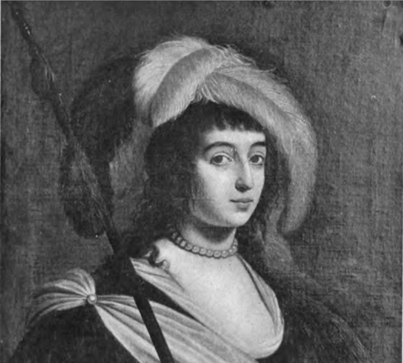
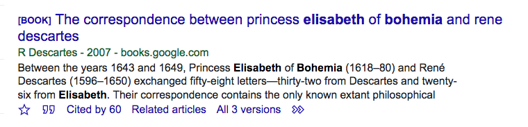
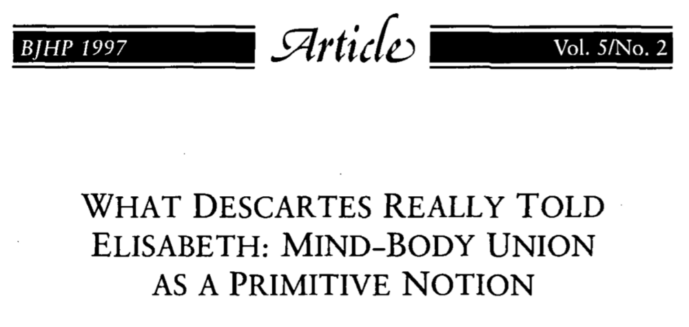
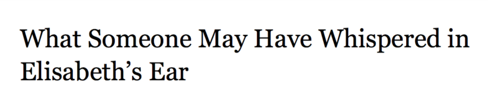
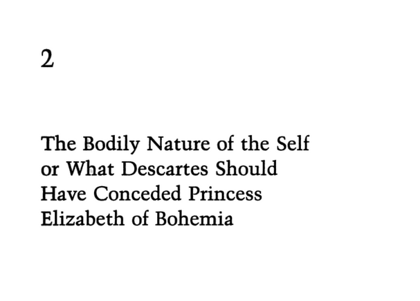

*Bohemia with hunting spear (fragment, from Godfrey 1909)*

By now we all know the tune. On the whole, women thinkers get less acknowledgement for their work. When they speak in meetings, their ideas get less uptake (unless they get [hepeated](https://www.urbandictionary.com/define.php?term=hepeated) by a man). When they write papers, they accrue fewer citations. Between 1993 and 2013, a single individual named ‘David’ attracted more citations in a set of generalist philosophy journals than all scholars who happen to be women combined ([Healy 2013](https://kieranhealy.org/blog/archives/2013/06/19/lewis-and-the-women/)). Much seems to prevent women actually getting credit for the mark they leave on the intellectual landscape (except when they’re typing up your manuscript, of course — witness [#thanksfortyping](https://twitter.com/search?q=%23thanksfortyping&src=typd)).

I was reminded of this mess when I came across a Google Scholar entry for an edition of the correspondence between Elisabeth of Bohemia (1618–1680) and René Descartes (1596–1650). They wrote each other during the mid-to-late 1640s. Yes, _that_ correspondence in which Bohemia raised one of the most devastating objections that still plagues any form of Cartesian substance dualism today.

The entry featured a massive omission.

*Google Scholar listing of the correspondence between Bohemia and Descartes*

While the ‘Title’ field correctly lists both authors, the ‘Author’ field below brashly reduces this to simply ‘R Descartes’. Our friend Renatus. So Descartes wrote the correspondence between Bohemia and Descartes? All fifty-eight letters travelling back-and-forth between The Hague, Egmond, Berlin and Stockholm? All those inkblots, hours toiled, corrections, those ‘Sorry I couldn’t write sooner’s? All single-handedly penned by Descartes.

Of course this is an automation error. The actual collection of the correspondence, [edited by Lisa Shapiro (2007)](http://www.press.uchicago.edu/ucp/books/book/chicago/C/bo4924190.html), naturally lists both authors. It even has Bohemia’s image prominently on its front cover. But still, my encounter did raise suspicions about how easily such tiny glitches, omissions and misrepresentations can creep in.

Digging further into Bohemia’s case, you can easily see some such patterns are not limited to automated cases. Even in scholarship of early modern philosophy, Descartes easily gets credit for ideas that were at least as much Bohemia’s. Not that Bohemia is totally ignored. It’s more subtle than that. We find ample cases where, because of how Bohemia’s role is represented, she’s just ever so slightly pushed away from center stage.

For example, going by one article ([Yandell 1997](https://philpapers.org/rec/YANWDR)), when Descartes and Bohemia correspond, that is not a two-way meeting of minds. Rather, Bohemia is being “told” things by Descartes.

*Article ‘What Descartes Really Told Elisabeth'*

Some articles even get more specific. On that presentation of her, Bohemia does not come up with her own argument. More grossly, when she unmistakably has ideas, that is just because people were whispering things in her ear ([Alexandrescu 2012](http://oxfordindex.oup.com/view/10.1093/acprof:oso/9780199659593.003.0001)).

*Article ‘What Someone May Have Whispered in Elisabeth’s Ear’*

When Bohemia eventually is able to squeeze a word in, she wins the argument (obviously). But that still doesn’t result in much recognition of her philosophical agency. We do not see Bohemia vindicated. Instead, over and over, attention shifts straight back to Descartes, who “should have conceded” things to her ([Johnstone 1992](https://philpapers.org/rec/JOHTBN)).

*Article ‘The Bodily Nature of the Self or What Descartes Should Have Conceded Princess Elizabeth of Bohemia’*

Yes, Bohemia figures in these articles. She even gets mentioned in their titles. Her name is no longer fully alien. But somehow, somewhere along the way her agency as a philosophical disruptor has been discarded, and she becomes nothing but a foil for people to talk at, whisper towards, or concede things to.

In the background of all this, Bohemia is persistently classified as a princess, rather than as a philosopher (too many examples, but consider: [Nye 1999](https://philpapers.org/rec/NYETPA), [Tollefsen 1999](https://philpapers.org/rec/TOLPEA), [Shapiro 1999](https://philpapers.org/rec/SHAPEA), [Jeffery 2017](https://philpapers.org/rec/JEFTOO-4)). Of course, Bohemia was a royal. But if it’s scholarly convention to list historical authors by their last name (where available), then branding Bohemia as a ‘princess’ while omitting that Descartes was a self-employed freelancer, exceptionalizes her. It marks her out as somehow not really the real thing. For a while, Anne Conway (1631–1679) similarly got branded ‘Lady Conway’, and Mary Shepherd (1777–1847) turned ‘Lady Mary Shepherd’— both designations luckily appear to be on the way out.

So where’s the good news? Bohemia’s work is increasingly taken up in scholarship of philosophy of the early modern period, a sign of growing commitment to bringing some more historical accuracy to that curiosity lingering on as the philosophical ‘canon’. That’s great. In May this year we’ll even have [a conference dedicated wholly to Bohemia’s work](https://historyofwomenphilosophers.org/event/elizabeth-of-bohemia-1618-1680-life-and-legacy-philosophy-politics-and-religion-in-seventeenth-century-europe/). But what my earlier examples signal is that acknowledging the reality of previously neglected achievements can take different forms.

One option:

> **Mere presence**. Previously neglected philosophers get to be ‘represented’. They figure on lists, they are name-dropped in conversations. But we never really figure out what they’re doing there. And perhaps it doesn’t really matter. For they’re mere props for our beloved, well-known Philosophers to bounce off some ideas.

Sounds bleak, eh? Rehabilitating authors by merely making them present can be unhelpful, because even though the name is there, we may omit the contribution. But there’s another option:

> **Participation** or **agential presence**. Previously neglected figures are present and actually doing some philosophy. They’re allowed to come up with plans, proposals or just simply ruminate on the agony of it all. We don’t get stuck on what they are, but are allowed to listen to what they say.

Google Scholar snatched Bohemia’s presence from a crucial segment of the history of philosophy. That clearly was an error. But philosophical scholarship that stages her merely as a passive pawn marks another form of neglect. That’s less than helpful. Fortunately, it’s easy to change. Let’s reduce the number of times people merely creep up to Bohemia, whispering, or conceding things to her. Let’s hear more from the philosopher herself.