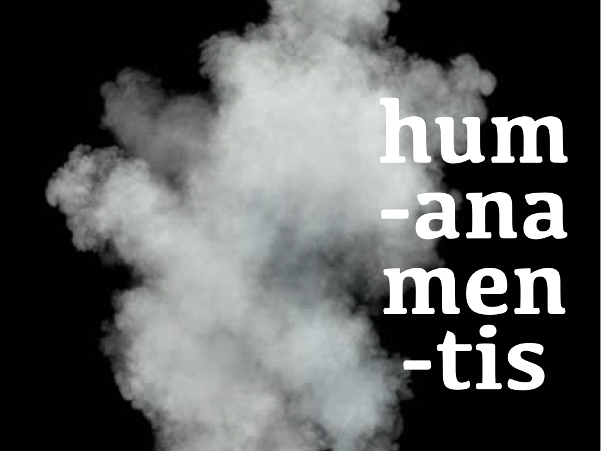

#### Introduction
“The philosopher”, Anton Wilhelm Amo states in his final published work, “should perpetually dwell on those things which can be known.” (Amo, 1738, p. 26) One of the phenomena that allow for certain knowledge, Amo thinks, is the human mind. The mind is the unchangeable, stable part of the human being (Amo, 1738, pp. 24, 26; cf. Meiner, 1734, p. 14). It should then be no surprise that the mind figures prominently in Amo’s thinking.

Amo’s view of the mind is of particular philosophical interest because of how his account of sensation restricts what he can say about the relation between mind and body, in particular the possibility of sense-based cognition. On the one hand Amo views sensation (and, as will become clear, perception) as a purely bodily process, not involving the mind in any way. On the other hand, he claims that ideas (that is, mental representations) not only can, but must, have a basis in sensation. But how can people begin to think about the sensible world around them at all, if no aspect of the sensory process has anything to do with the mind? Amo’s commitments land him with a distinct philosophical puzzle.

Amo (c. 1703–c. 1759) was a legal scholar and natural philosopher. He worked in early eighteenth-century Prussia, for the most part at the universities of Halle, Jena, and Wittenberg. Born in the Axim region in Guinea, present-day Ghana, he was among the first African philosophers working in Europe.<a id="footnote-1-ref" class="footnote" href="#footnote-1">1</a>

While at Halle, Amo wrote a dissertation in law, On the Rights of Moors in Europe (_De jure Maurorum in Europa_, 1729). The work is now presumed lost. His legal thesis was followed in the 1730s by two philosophical works: _On the Impassivity of the Human Mind_ (_Dissertatio inauguralis philosophica de humanae mentis ἀπαθεία …_, 1734), and his _Treatise on the Art of Philosophizing Soberly and Accurately_ (_Tractatus de arte sobrie et accurate philosophandi …_, 1738), a work on psychology, logic, and the art of reasoning. In addition, there is credible evidence that Amo not only supervised but also (co-)wrote Johannes Theodosius Meiner’s dissertation, _Philosophical Disputation Containing Distinct Ideas of what Belongs either to the Mind or to our Living and Organic Body_ (_Disputatio Philosophica …_, 1734).<a id="footnote-2-ref" class="footnote" href="#footnote-2">2</a> Amo’s lectures as an instructor (_Privatdozent_) are reported to have covered the “most elegant and curious” parts of philosophy, physiognomy, political philosophy and cryptography (Lochner, 1958, p. 177; Abraham, 1964, pp. 77–78).

So far, scholarship on Amo’s work has been limited. Most studies concentrate on aspects of Amo’s life (e.g. Grégoire, 1808:198–202; Lochner, 1958; Abraham, 1964, 2008; Brentjes 1969, 1975, 1976; Fikes, 1980; Bess, 1989; Sephocle, 1992, Hountondji, 1996; Damis, 2000; Kandé, 2000; Bemile 2002; Mougnol, 2010) though some contributions do pay specific attention to his philosophy (e.g. Wiredu, 2004; Mabe, 2014; Emma-Adamah, 2015; Smith, 2015; Meyns 2019).

Here I will discuss why Amo’s account of the mind should be seen as a development of Descartes’ theory, a development that absorbs elements from the early eighteenth-century medical tradition. Amo follows Descartes by embracing the latter’s basic distinction between passive matter and active mind. However, he complains that a consistent account of what it is for the mind to be purely active must accept that the mind can have no sensation. This leads Amo to defend a thoroughly representational theory of mind. A closer look at his exact view and its motivations is welcome, because it can advance our understanding of Amo’s contribution to the early modern study of the mind, which has so far received scant attention.

The structure of this article is as follows. Section 2 looks at Amo’s account of what the human mind is, and Section 3 shows how this account leads him to make the strong claim that minds cannot sense. Section 4 discusses what, given this ‘impassive’ view of the mind, Amo can say about the relation between mind and body. Against the background of this framework of the mind-body relation, Section 5 looks at Amo’s theory of cognition and considers to what extent he can avoid worries that a fully spontaneous, self-determining mind is epistemically isolated.

#### What is a human mind?

What is a mind? Amo takes the human mind to belong to the genus of spirit, which in turn he characterizes as:

> “Any substance which is purely actual, immaterial, in and of itself always understanding, and operating spontaneously from intentions, with an end of which it is self-conscious.” (Amo 1734, p. 4)

Six essential features of spirit are attributed in this passage. Spirit is: (i) a substance, which signals that it exists independently and is not itself a feature of anything else. It is (ii) purely actual, indicating that spirit admits no potentiality. In addition spirit is (iii) immaterial; (iv) always understands (or is ‘conscious’, conscium); (v) it operates spontaneously (by self-determination); and (vi) it is purposive, or end-directed.

Because Amo thinks that the human mind belongs to the genus of spirit, the human mind automatically inherits features (i-vi). Within the genus of spirit, the human mind has the following distinguishing feature:
 
> “The human mind is: a purely actual and immaterial substance which, in exchange (_commercio_) with the living and organic body in which it belongs, understands and operates from intentions to an end of which it is self-conscious.” (Amo 1734, p. 8)

Human minds are distinctive as spirits in virtue of (vii), exchange with a body, specifically a living, organic body. Accordingly, Amo marks out both mind and body as essential parts of the human being (Amo 1734, pp. 8-9).

Amo does not elaborate his mercantilist metaphor of ‘exchange’, but it was not an exceptional figure of speech. Already in classical Latin, ‘_commercium_’ occurs figuratively to refer to relations of correspondence between things generally, also in a non-commercial sense. Furthermore, in Amo’s time the terminology of exchange was used to describe some form of interaction between mind and body. In an article for the _Bibliotheque germanique_, historian Johann Jakob Brucker (1696–1770) writes how Descartes and others seek to explain how the “exchange between soul & body is realized” (p. 91). Also Johan Gottfried Berger, one of Amo’s sources, in discussing the nature of the human being speaks of the meeting of thoughts and motions and of  “the reciprocal exchange of passions and actions” (Berger 1708, p. 6). Surprising, however, is Amo’s exact use of the terminology of exchange. As will become clear in Section 4, he, exceptionally, uses it to capture an asymmetric relation rather than a two-way influence.

If the human mind is essentially in exchange with a living, organic body, then what is this body? Amo defines material things as being ‘contrary’ to immaterial ones: “If something is immaterial,” he writes, “it follows that it cannot be material: because they are contrarily opposed, for the predicate of immateriality excludes the predicate of materiality, because the presence of immateriality is the absence of materiality” (Amo 1734, p. 6) This means that the human mind, according to Amo, is a purely actual, immaterial, conscious, spontaneously and purposively operating substance which stands in relation of exchange with a living and organic, material thing.

In his account of the mind, Amo to some extent follows a traditional Cartesian line. Descartes, whom Amo cites, equally emphasized the immateriality of the mind, and its nature as a thinking thing. Nonetheless, Amo differs from mainstream Cartesianism in assuming that the mind’s operations are exclusively spontaneous. Descartes’ work on perception and the passions makes it clear that Descartes thought that the mind could equally be passive. For instance, in Meditation VI he says that some of his sensory ideas arrive “without any consent of mine” (Descartes 1964–1976, vol. VII, p. 75) and relies on this passivity to demonstrate the existence of body (Descartes 1964–1976, vol. VII, pp. 79–80). In his Sixth Replies to objections to his _Meditations_, when distinguishing several ‘grades’ of perception, he emphasizes that perceptions at the second grade simply happen to us (these include “everything that immediately results in the mind on account of its being united to the bodily organ that is affected”, Descartes 1964–1976, vol. VII, p. 437). His _Passions of the Soul_ (1649) identifies the soul as passive insofar as it undergoes a certain occurrence (rather than making it happen) (Descartes 1964–1976, vol. IX, p. 328, cf. pp. 343, 347, 349). Amo does not accept this. Drawing on his assumptions about what the mind is, Amo says that he defends “against Descartes (_Contra Cartesium_)” the thesis that humans do not sense material things with their mind (Amo, 1734, p. 13). Human minds, on his view, cannot sense.

#### Does the mind not sense?

Amo sees it as a direct consequence of his account of the nature of the mind that minds cannot have sensation. Sensation has traditionally been taken to require passivity, a necessary condition Amo accepts. But he argues that precisely such passivity is repulsive to the mind. Minds are impassive, or without passion. Hence, they cannot sense. Amo defends his claim most extensively in his 1734 treatise, and relies on that work in later publications (Amo 1738, Meiner 1734). What exactly is Amo’s claim, and how does he argue for it?

Amo simply defines the ‘impassivity’ of the human mind as the absence of sensation: if a substance is impassive, it cannot sense and lacks a faculty of sensing (Amo 1734, pp. 4, 10, 13). (In his Latin text, Amo uses the Greek ‘ἀπαθεία’ untranslated.) Amo’s definition resonates with, but is more specific than, the general idea of lacking pathos (πάθος), that is, the idea of a being not undergoing, feeling or suffering anything. In the ancient Stoic philosophical tradition apatheia was often referred to as a condition of being free from emotion, while in Latin Christian texts the concept is often associated with the doctrine of divine ‘impassibility’, the idea that God cannot suffer or undergo anything whatsoever. For Amo, impassivity is more specific: it is just the absence of sensation.

Given the centrality of talk of sensation to Amo’s philosophical position, it will be crucial to specify how he understands this notion. Sensation (Lat. _sensio_), according to Amo, is what happens when the “sensible properties of immediately present, material things really act against the sense organs” (Amo 1734, pp. 10-11). From his definition, it is clear that Amo uses ‘sensation’ to refer to the basic process of stimulation of the bodily sense organs. This means that he does not take sensation as such to involve mental representation or any particular phenomenology. In taking this stance on the nature of sensing as a purely corporeal process, Amo stays comparatively close to the physiological traditions of his time. Building on his definition of sensation, the faculty of sensing is defined in terms of its exercises, as “That disposition of our organic and living body, by means of which an animal is affected by material and sensible things and their immediate presence.” (Amo 1734, p. 11) (Amo there also notes that he uses ‘sensation’, ‘sensing’ (_sensius_) and ‘sense’ (_sensio_) synonymously.)

Amo rarely uses the term ‘perception’ or its cognates. However, from his claim--the only mention of it in the whole of his _Impassivity_--that in certain of its operations the mind “… represents or makes present to itself things previously perceived with the senses and sensory organs” (Amo 1734, p. 7), it is clear that he conceives of perceiving as a process (given his use of the verb form), which pertains to the senses and sensory organs. As he thinks of the senses as operating purely corporeally, then processes performed with the senses must likewise be corporeal. Similarly, in his _Treatise_ of 1738 Amo uses the term exclusively when speaking of what is perceptible with the senses (for instance: “Intentional objects of the human mind are (a) sense perceptibles (_sensu perceptibilia_), (b) intelligible things (c) actions”, Amo 1738 p. 6; and “Things occurring in fantasy & in imagination, are sense perceptibles (_sensibus perceptibiles sunt_)”, Amo 1738, p. 84). Hence, Amo talks of perceiving as the bodily process of registering something which is present to the sensory organs, or to pick up that set of objects which can thus be detected.<a id="footnote-3-ref" class="footnote" href="#footnote-3">3</a>

Dialectically, Amo’s definition is surprising. For one, his definition of impassivity as the absence of sensation might render his argument trivial. If being impassive just is having no sensation, what do we learn when told that an impassive mind cannot sense? However, placing things in perspective, we should note that Amo’s intended contribution lies not in a conceptual analysis of impassivity. Rather, it lies in demonstrating that the human mind is impassive as a matter of fact. Such a factual claim is far from trivial, because one can resist it on empirical grounds. It does, however, weaken Amo’s argumentation. His strict definition impassivity conveniently reduces his argumentative load: he only has to rule out that minds can sense. But it equally leaves him vulnerable to objections. An opponent could insist that passivity consists not just in having external sensations, but in any form of undergoing, including for example having passion or emotion. While Amo sometimes makes more encompassing claims (“I have shown that spirit does not sense or suffer,” Amo 1734, p. 6), he does not belabour them systematically. Perhaps he thinks that his case for the mind’s lack of sensation will automatically extend to any other form of passivity? The text does not resolve the point.

Even more serious are issues with Amo’s account of sensation and the faculty of sensing. Amo defines sensation as a process in which sensible properties stimulate the sense organs, and captures the faculty of sensing as a disposition of a body. Presumably, sense organs are corporeal things--eyes, ear drums, skin, and so on. Hence, both Amo’s definitions already incorporate reference to the body. Such a definition of sensation certainly risks a circularity in the argument for Amo’s conclusion. Once we define sensation as requiring a body, how could it ever be shown to belong to a mind? As we will see, precisely these definitions already settle in advance at least part of Amo’s case.

With his key notions clarified, Amo can begin arguing for the mind’s impassivity (Amo 1734, pp. 15–18). Specifically, he defends three theses:

* [T1] The human mind is not affected by sensible things
* [T2] There is no faculty of sensing in the human mind
* [T3] Sensation and the faculty of sensing belong to the body

Amo at points presents (T3) as following by elimination. Once he has shown that neither sensation nor the faculty of sensing belong to the mind (T1 and T2), he can infer that both must belong to the body. Of course, such inference relies on an additional exhaustiveness and exclusivity premise:

* [E] Sensation and the faculty of sensing belong either to the human mind or to the body

He indeed explicates this assumption: “Sensation and the faculty of sensing belong either to the mind, or to the body. Not to the mind, as has been extensively deduced. Therefore [they belong] to the body.” (Amo 1734, p. 18)

An ontology in which mind and body strictly exclude one another and exhaust the range of substances would fit with this premise. However, Amo still ignores several theoretical options. He neglects the possibility that certain processes could be facilitated by mind and body jointly, or that they could be facilitated by some third thing--say, a union of mind and body. He insists: “… we should not confuse those things which belong to the body and to the mind respectively. For whatever consists in the pure operation of the mind, is to be attributed only to the mind; whatever truly presupposes sensation, and the faculty of sensing, and concepts involving matter, that is all to be attributed to the body.” (Amo 1734, p. 18) He appears to take this point to apply not just to properties, but to processes and operations as well. This explains why he takes his central argumentative burden to be a defense of (T1) and (T2).

About (T2) Amo is brief. He gives just a single proof: The faculty of sensing only belongs to things that are alive; that is, inanimate things cannot sense. Whatever is alive, Amo points out, has circulation of the blood. Only bodies can have blood circulation. Hence, the faculty of sensing can only belong to a body (Amo 1734, p. 17).

To back up his crucial premise--that whatever is alive must have blood circulation--Amo refers to various authorities, including scripture and texts in physiology (Amo 1734, p. 17). Already a century earlier in his _On the Motion of the Heart_ (Frankfurt, 1628), William Harvey had called the heart “the foundation of life” because of its role in moving blood through the body (Harvey 1628, ch. VIII). The relatively more recent texts that Amo cites include statements such as: “… from all that (…) pertains to the motion of the blood, it is hardly difficult to see that life depends on its circulation” (Berger 1708, ch. V, p. 112), and “… the role of this kind of circulation is so great, that we must say that without it life could not continue even for a moment.” (Vater 1712, p. 702) (Not directly cited here by Amo, but plausibly in the background, is Descartes’ work in physiology, such as his _Discourse on Method_ parts 5–6, published 1637.) These physiological texts provide Amo with some support from contemporary science. Of course, these sources could also be thought to weaken his case. Does the medical profession not have a restricted domain, namely that of animals? Blood circulation might be necessary for life in the type of creatures that physiologists study. But that does not establish the universal thesis that it is necessary for life as such. That Amo has left open.

Amo’s argument for (T2) is peculiar, because its conclusion does not actually support the thesis. Rather it supports (T3), namely that sensation and the faculty of sensing belong to the body. Only with the additional supposition of (E) could he draw the inverse conclusion (i.e. T3 and E, therefore T2). Charitably read, one may conclude that Amo sees his theses as mutually supporting.

Amo devotes the heart of _Impassivity_ to several proofs of (T1). In one of these arguments, he notes that a being that senses must also be alive. He even insists that: “To live and to sense are two inseparable predicates” (Amo 1734, p. 16). Being alive, however, is a feature only of divisible bodies, such that “if the human mind were to sense, it follows it would be a divisible body.” (Amo 1734, p. 15). But an immaterial thing is no divisible body--which completes his reductio.

The most significant support for (T1) comes in the form of a simple syllogism: “No spirit senses material things; and yet the human mind is a Spirit, therefore it does not sense material things.” (Amo 1734, p. 15) We can make Amo’s reasoning formally explicit by supplying some hidden premises, as follows:

1. Spirit is purely actual (ass.)
2. Whatever is purely actual does not admit passion (ass.)
3. Spirit does not admit passion (from 1, 2)
4. To sense material things is to admit passion (ass.)
5. Spirit does not sense material things (from 3, 4)
6. The human mind is a spirit (ass.)
7. The human mind does not sense material things (from 5, 6)

Here (1) is simply Amo’s definition of spirit, while (2) relies on his assumption that actuality and passivity are opposites. Premise (4) presents sensation as one instance of being passive, based on his definition of sensation as involving sense organs being acted upon--a passive state. Premise (6) is an instance of genus-species classification, which Amo assumes does not allow for contradiction (Amo 1734, pp. 15–16). Amo accordingly concludes that sensation is categorically absent from the human mind.

One may find that premise (4) moves a bit fast. Must sensing material things automatically equate to admitting passion? Could sensing not be an active process? Predominantly, in (4) we see Amo’s definitions at work. His assumption is less surprising given that he defines impassivity wholly in terms of sensation. Further, Amo also silently supposes that sensation must involve materiality. Again this makes sense, given that he defines sensation as a process of stimulation of bodily sense organs (and not, say, as involving mental representation or a certain ‘feel’ of experience). His definition of the faculty of sensing too already included references to the body. What this brings out is how Amo’s narrow, tailored definitions of impassivity and of sensation play an argumentative role. Amo does not explicitly rule out the possibility of intellectual or non-material passivity. Rather, the exclusion naturally follows from how he has defined his core notions.

Amo centers his discussion on a specific question: Does the human mind sense? As much of his background is in the physiological tradition, the more general questions about the relation between mind and body are never much his focus--he devotes no sections, theses, or notes to them. Still, Amo’s conclusion that the human mind lacks sensation does give rise to more general puzzles about the mind-body relation. Amo says that the human mind is not acted upon, but operates fully spontaneously. However, he also holds that minds are distinctive in the category of spirit for operating in conjunction with a body. How should that relation be envisaged? As will become clear, Amo ends up with an account that is far from standard in the early modern period.

#### How does a human mind relate to its body?

What is the relation between mind and body? Amo is quite clear about how he thinks bodies and minds could not relate. There could be no communication, penetration, or direct contact between a mind and a body. This is because minds are spirits, and communication is impossible for any spirit. Communication, Amo argues, requires parts or properties of one being to come to be in another (Amo 1734, p. 5). Yet spirits could never receive such parts or properties:

> “No parts, properties and other effects of a being can come to be present in a spirit by means of some act; otherwise spirit would contain in its essence and substance something other than what it ought to contain.” (Amo 1734, p. 5)

The relevant assumptions here are that spirits are simple, and that if they are simply, they cannot contain extrinsic things. Hence spirit and body cannot communicate with one another (Amo 1734, p. 5).

Likewise, spirits can also not undergo penetration, or the “transition of a being through parts of another being” (Amo 1734, p. 6). Penetration too would presuppose that spirits have constitutive parts, which they do not (Amo 1734, p. 6). Assuming that spirits are unitary and altogether lack parts, Amo’s reasoning leads to the conclusion that spirits cannot be penetrated.

Amo’s reliance on the idea that spirits are unitary reflects both medieval and more recent early modern debates. For example, G.W. Leibniz in _Monadology_ (written 1714) insisted that spirits are partless (because they are not material), and that whatever lacks parts cannot be acted upon. After having introduced the monad as “a simple substance (…) without parts” (Leibniz 1969, §1), Leibniz notes:

> “There is also no way of explaining how a monad can be altered or changed in its inner being by any other created thing, since there is no possibility of transposition within it …” (Leibniz 1969, §7)

If substances are partless, then they cannot be changed by being acted upon. Although Amo does not cite Leibniz, he argues against the idea that minds could be acted upon or penetrated in the same way.

Finally, spirit and body can not be in contact, as this would require that “two surfaces in some physical or sensible point in some way mutually touch” (Amo 1734, p. 5). Citing Descartes’ letters to Elisabeth of the Palatinate, Amo points out that only bodies are candidates for touching (because they have surfaces) (Amo 1734, p. 6). Hence, if spirits cannot touch, neither can they be in contact with anything.

While Amo clearly rules out any form of communication, penetration or contact between body and mind, recent scholars are divided on how to capture Amo’s positive account of how mind and body do relate.

Some suggest that Amo, in a Leibnizian spirit, accepts some form of a pre-established harmony theory. For example, Emma-Adamah states that Amo  “… side[s] more readily with the Leibnizian framework of pre-established harmony--in which the operational sovereignty of the mind and the body is preserved.” (Emma-Adamah 2015, p. 156) Similarly, Smith concludes: “… it is clear that his [Amo’s] conception of spirit, body, and the relationship between them is broadly Leibnizian” and that Amo “… echoes the Leibnizian side of the debate between Leibniz and Stahl” (Smith 2015, p. 23). The latter point refers to disputes in the 1700–10s between Leibniz, who held soul and matter to be strictly separate, and Georg Ernst Stahl’s (1660–1734) stance that in living organisms the soul animates the body (later published as _Negotium Otiosum_, 1720).

There is reason to be dissatisfied with the claim that Amo’s view is a pre-established harmony theory. Certainly, Amo’s overall position that body does not act upon the mind is comparatively closer to Leibniz or Christian Wolff’s view than it is to Stahl’s vitalism. However, comparative proximity is no ground for attributing any a specific theory of the mind-body relation. That Amo is no vitalist, does not by itself establish that he thinks mind and body do not more than correlate harmoniously. But any direct evidence for attributing a pre-established harmony theory to Amo is lacking. Amo does not use terms characteristic of that view, such as ‘harmony’ or ‘concord’. In all his extant work, Amo mentions Leibniz only once--and not for philosophical content, but in a long list of people he considers ‘erudite’ (Amo 1738, p. 21).

More importantly, some of Amo’s statements about the mind-body relation do not fit well with a harmony theory. As noted, one of Amo’s core points is that the human mind is distinctive in the genus of spirit, for standing in an ‘exchange’ with a living, organic body:

> “Exchange of body and mind consists in these that (1) it [sc. the human mind] uses the body in which it is as a subject (2) as an instrument and medium of its operations.” (Amo 1734, p. 8)

A mind cannot suffer or be acted upon, but it can use (_utatur_) the body as an ‘instrument’ or ‘medium’ in its operations, according to Amo. More strongly, in his later _Treatise_ Amo says that the mind can issue an “effective act” (_actus mentis effectivus_) in conjunction with the body. An effective mental act is “that faculty of mind by means of which, using media, actual thoughts get a beginning, existence & essence.” (Amo 1738, p. 45; cf. Meiner 1734, pp. 5, 10) Using the body as an instrument and issuing effective mental acts in conjunction with it are far removed from the strict isolation of mind from body asserted in a typical harmony theory. That is, if one thing can ‘use’ another an instrument or medium, and is able to issue an ‘effective act’, then that points to at least one direction of causal operation. Amo seems to accept an asymmetric model of mind-body exchange: allowing mind-to-body operations, but denying the same for any body-to-mind occurrences.<a id="footnote-4-ref" class="footnote" href="#footnote-4">4</a>

Amo’s asymmetric model of mind-body exchange is better understood as a development of the physics and metaphysics that he finds in Descartes (see: Wiredu 2004; Mabe 2007, who speaks of ‘dualistic materialism’, p. 76; also in Smith 2015). Amo himself clearly flags his Cartesian intellectual orientation. Alongside references to recent physiological traditions (Berger, Vater, the physicians Daniel Sennert, 1572–1637, and Georg Daniel Coschwitz, 1679–1729) and work by the philosopher and theologian Jean Leclerc (1657-1736), he repeatedly cites Descartes with approval, including the latter’s correspondence and _Passions of the Soul_ (e.g. 1734, pp. 7, 11).

That Amo at points criticizes Descartes is consistent with the claim that he builds upon the latter’s work, because Amo's criticism nowhere amounts to a wholesale rejection of the Cartesian project.<a id="footnote-5-ref" class="footnote" href="#footnote-5">5</a> Amo charges Descartes with contradicting himself (“_… sibi aperte contrarium dicit_”, Amo 1734, p. 13) when the latter claims that the soul could suffer with the body. He believed that only his own proposal made for a consistent formulation of Descartes’ core insights.<a id="footnote-6-ref" class="footnote" href="#footnote-6">6</a>

Perhaps surprisingly, how Amo develops Descartes--acknowledging obstacles to causal efficacy--brings him closer to those philosophers working in what has come to be known as the ‘occasionalist’ tradition. Building upon Cartesianism, authors such as Géraud de Cordemoy (1626–1684), Louis de la Forge (1632–1666) and Nicolas Malebranche (1638–1715) had argued that created beings cannot cause their own states, but instead that causation in the created world is due to God.

In fact, modifying Cartesianism in this manner was not unique in Amo’s context. Berger, whom Amo frequently cites, had a strong background in cartesian physiology, drawing especially on _Treatise of Man_ and _Passions of the Soul_ and on how ideas about hydraulic-mechanical ‘machine’ of the body are developed by physicians such as Herman Boerhaave (1668–1738) and Cornelis Bontekoe (1647–1685), among others. In his _Physiology_, Berger himself even comes close to an occasionalism as the only logical way to formulate this view. For instance, speaking of sensation, Berger had said that the “very powerful architect of things” makes it the case that on “an occasion of certain movements of a body, the mind excites certain thoughts in itself” (Berger 1708, p. 325), citing Cordemoy and Malebranche.<a id="footnote-7-ref" class="footnote" href="#footnote-7">7</a>

There is however no indication that Amo accepts any ‘full-blown’ form of occasionalism that embraces the total causal impotence of created substances. He nowhere states that all creaturely operations are to be attributed to God, and moreover clearly thinks that the mind does act.<a id="footnote-8-ref" class="footnote" href="#footnote-8">8</a> Still, it shows that within Amo’s context, there was a precedence of developing Descartes’ starting point into such an occasionalist direction.

#### How does cognition work, if the mind does not sense?

Amo maintains that the mind does not sense, and as a consequence that sensing belongs only to the body. What, if anything, are the wider consequences if his view? One concern may arise about the possible objects of cognition. If the human mind does not sense, must it end up in epistemic isolation, cognizing only itself? How can people begin to think about all of the sensible world around them? This issue, among many other things, Amo begins to take up in his _Treatise_ of 1738.

Where Amo’s _Impassivity_ provided a framework for how to think about the nature of mind, his _Treatise_ treads onto new terrain. Without being modelled on one particular example, it resonates with a number of texts that contain instruction on logic and the psychology of reasoning. Parallels include Ramon Lull’s _Ars Magna_ (1305), Descartes’ _Rules for the Direction of the Mind_ (ca. 1628, unpublished during his lifetime), or Pierre Nicole and Antoine Arnauld’s _Logic, or the Art of Reasoning_ (1662), as well as Leclerc’s adaptation thereof in his own _Logic_, the last of which Amo evidently read. In this work, as part of a wider study of reasoning, Amo lays out a psychology that fits his picture of an unaffected mind.

Already in his 1734 work Amo assumed that the human mind operates with ideas. ‘Idea’ he defines as an “… operation of our mind, by which it represents or makes present to itself things previously perceived with the senses and sensory organs.” (Amo 1734, p. 7; cf. p. 15). Ideas, in short, are representational. With a feel for over-generalisation, Amo even states: “An act of mind is nothing other than representative (_repraesentativus_)” (Amo 1738, p. 60, cf. p. 62).<a id="footnote-9-ref" class="footnote" href="#footnote-9">9</a>

Perhaps it will be found surprising that Amo specifies that the mind, in having ideas, represents to itself prior sensory states. Indeed, Amo insists that sensation is the foundation of all cognition. Repeatedly he cites what has come to be known as the ‘peripatetic dictum’: “Nothing is in the intellect, which had not previously been in the senses” (Amo 1738, p. 63, cf. pp. 59, 62, 70). (While a Greek equivalent of the phrase does not appear in Aristotle, but the idea occurs widely in Aristotelian traditions; Cranefield, 1970.)

Why would Amo insists on a sensory basis of all cognition, especially after having convinced himself that no mind could ever sense? Recall that in _Impassivity_ Amo defined ‘sensation’ as simply involving processes of bodily sense organs being stimulated, and nothing more. Hence, prior instances of sensation are then nothing but prior cases of those sense organs being operated upon in a certain way. No evident internal pressure--such as completeness or consistency--requires him to adopt the view. Instead, the point seems to have appeared independently attractive to him.

Amo’s claim that nothing is in the intellect which was not previously in the senses places his relation to seventeenth- and early eighteenth-century European philosophical traditions in a fresh light. It signals a distance from Descartes, who accepts that at least certain notions are not of sensory origin, but innate (Descartes 1964–1976, vol. VII, p. 51). The claim places Amo closer to an author such as John Locke, a prominent endorser of the peripatetic dictum nearer to Amo’s time (Locke 1689, II.i.23). Amo does not cite Locke, and there is little indication that the latter was widely read in early eighteenth-century German circles (Fischer 1975; Brown 1951). Amo does, however, draw heavily on the work of Jean Leclerc, who dedicated a work to his friend, “the most learned and sharp Mr. John Locke” (Leclerc 1704), and who had integrated Lockean elements into his Logic. Some of the appeal of giving cognition a foundation in sensation may for Amo have come through this route.

But this does not yet answer how sensation could be the basis of all ideas, if the mind itself does not sense. In other words, how do humans achieve sense-based cognition? Amo sees a central role for the mind’s acts of attention and reflection. “Attention,” Amo says, is an act in which “… the mind directs all its faculties of understanding, and all senses, uniquely to a proximally present object” (Amo 1738, p. 84). In this scenario, it is the body that passively undergoes sensory stimulation, while the mind wholly spontaneously attends to what goes on in the bodily sense organs. Hence, without the mind itself sensing in a strict sense, it can nonetheless draw on the result of corporeal sensory stimulation. All of this is consistent with Amo’s assumption of the mind’s impassivity.<a id="footnote-10-ref" class="footnote" href="#footnote-10">10</a>

More specifically, according to Amo, sensation establishes what he calls an “archetype” (Lat. _archetypo_) for the mind to attend to. He notes: “… there is no intellection & idea without an archetype perceptible to the senses” (Amo 1738, p. 83). Roughly, Amo uses the notion of an ‘archetype’ for the referent of an idea. Perhaps controversially, Amo hints at a principle of isomorphism as a basis for sensory representation, suggesting: “… when an object is represented, the intellect as such expresses an actual likeness (_similitudinem_) with the thing known.” (Amo 1738, p. 60) Hence, the archetype secures the object of cognition in sensible reality. The mind’s operations can go ‘beyond’ sensation,  because in representing states to itself, the mind can make such ideas present also when sensory operation is actually absent.

Amo’s use of the notion of archetype has its precedence. Locke used it in his Essay also to indicate the referent of an idea. For example, in one particular case he writes: “… his idea is so far defective and inadequate, as it is distant from the archetype and pattern he refers it to …” (Locke 1689, II.31.4) Similarly, Descartes sometimes refers to an archetype as an original cause and referent of an idea: “… we have to arrive at some first idea, the cause of which takes the form of an archetype (_archetypi_)” (Descartes 1964–1976, vol. VII, pp. 42). Hence Amo, while steering clear of any causal language, in using the notion of ‘archetype’ hooks on to an existing debate on ideas and reference.

What about ideas that are not obviously sensory, such as the idea of justice, substance, spirit or even that of the mind itself? Amo insists that the human mind cannot really have ideas of those imperceptibles directly, stating: “The mind is not able to represent things as such, but only the properties and qualities of a thing, perceptible & perceived by the senses.” (Amo 1738, p. 59, cf. p. 62). The mind gets at these ideas, however, through its capacity of reflection.

Amo sees a true psychological divide between operations of mind that come ‘before’ (_ante_) and those that occur during or after any form of reflection. In pre-reflective--also called ‘instantaneous’ or ‘momentary’ (_momentaneus_)--mental acts, the mind simply apprehends ideas (Amo 1738, p. 83ff).  In reflective mental acts, on the other hand, the mind goes beyond mere cognitive grasping. Amo defines ‘reflection’ (_reflexio_) as that process in which “the mind inquires into the existence, origin and nature of a thing, [into] how it is known as such & with regard to [its] purpose.” (Amo 1738, p. 47)<a id="footnote-11-ref" class="footnote" href="#footnote-11">11</a>

According to Amo, contemplative reflective acts make possible ideas about things or qualities that are not directly perceptible themselves<a id="footnote-12-ref" class="footnote" href="#footnote-12">12</a>:

> “Things coming in contemplation are 1) God & the purposes of things & divine operations, 2) the human being & the purposes and operations of human things. Things with a divine purpose or operation are spirit, matter, and the properties, parts & effects of both; [Things with a] human purpose and operation are all beings of reason, things pertaining to morals, politics, artificial things.” (Amo 1738, p. 95)

Amo’s contrast between pre- and post-reflective operations remotely echos Locke’s now familiar distinction between sensation and reflection as sources of ideas (1689, II.iii–vii ff). Locke had captured reflection as: “the operations of mind about its other ideas” (Locke 1689, II.vi), and mentions the ideas of willing and understanding as examples of ideas received in such fashion. Reflection combined with sensation can give us ideas of pleasure, pain, existence, unity, power, and many others (Locke 1689, II.vii). Leclerc, Amo’s more direct source, actually speaks of a contrast between sensation and ‘meditation’ (_meditatione_) as the two sources of ideas (Leclerc 1700, pp. 11–12).

Through his accounts of attention and reflection as performed upon ideas, Amo provides a explanation of how, without the mind itself being acted upon, sensation can be a foundation of all human cognition (his ‘nothing in the intellect’ claim), and how cognition can extend beyond mere sensory ideas to ideas about imperceptibles.

The account of mind and psychology that Amo ends up with exhibits a score of intellectual affinities. As noted, his account of the operation of the mind as working with representational ideas is in no way exceptional in early eighteenth-century psychology. One might suspect that Amo’s focus on representation must be inspired by the work of Leibniz or Wolff. Consider how Wolff in his _Rational Psychology_, published the same year as Amo’s _Impassivity_, had stated: “The essence of the soul consists in a representative force (_vi repraesentativa_)” (Wolff 1734, §66). However, as pointed out earlier, there is little support for any direct influence along this line, as Amo nowhere cites Wolff or Leibniz. Instead, when considering Amo’s direct sources, on this point he by far most frequently cites Pierre de Saint-Joseph (1594–1662), an author working in Augustinian and Thomist traditions, whose _Idea of rational philosophy_ (1654) depicts the soul as representational throughout. Moreover, in 1734 Amo had already mentioned Berger’s _Physiology_ as a source on representation, as well as Descartes’ letters (vol. I, letter 29 and 36; and vol. III, letter 115, which is actually from Le Cleselier on Descartes) (Amo 1734, p. 7). Hence a range of sources was available to Amo in developing his view on the centrality of mental representation.

#### Conclusion

Human minds, Amo argues in his 1734 text, are spirits--spontaneous, active substances--which have exchange with a body. Because minds are purely active, he maintains that human minds cannot sense; for sensing is being acted upon, rather than operating spontaneously. Still, while the human mind cannot undergo anything, it can use its body as an ‘instrument’ in its acts. So Amo ends up with and asymmetry: he allows mind-to-body, but not body-to-mind operations. Amo views his position as building upon, and improving, the Cartesian philosophy of mind. Amo’s philosophy of mind can fruitfully be placed among a wider set of (occasionalist) developments of cartesian physiology formulated in the later seventeenth and early eighteenth centuries, including in Amo’s immediate circles.

Perhaps surprisingly, and possibly spurred by a wish to avoid concerns about a mind ending up in some form of epistemic isolation, in his later 1738 work Amo combines his claim that the mind cannot sense with a nonetheless sensory basis for cognition. In a more Lockean spirit, he even goes so far as to suggests that there is nothing in intellect which was not previously in the senses. Among other things, he explains how purely active processes of attention and reflection can get human minds from this sensory basis to ideas of imperceptible things.

Amo’s resulting position in philosophy of mind may appear somewhat eclectic. He incorporates elements from both Cartesian and Lockean traditions, though never copies any single model exactly. In particular, what continues to set Amo apart from all his influences is precisely his asymmetry model, which strictly rules out any passivity in the mind. By contrast, Locke accepted the mind as passive (e.g. “In the reception of simple ideas, the understanding is for the most part passive.” Locke 1689, II.ii.25) and, as noted, so did Descartes, who required passive sensation in demonstrating the existence of body. All of this helps us locate Amo at a crossroads in debates on the mind, and shows how in early eighteenth-century Germany the study of the mind-body relation had many moving parts. ✖

#### Notes

1. 
Amo regularly foregrounds his Guinese background, for example by signing his works as “Antonius Guilielmus Amo, Guinea - Afer”, that is, from Guinea, African (Amo 1738, p. 20). Moreover, he returned to his native region later in life. <a href="#footnote-1-ref">↩</a>
2. 
For example, in Meiner’s text it reads: “What the human mind is, and what our living & organic body is, we have said in our dissertation On the ἀπαθεία of the human mind” (Meiner 1738:4), which is a first-person reference to Amo’s 1734. Ludovici (1738, vol. III, p. 361) attributes the work directly to Amo.<a href="#footnote-2-ref">↩</a>
3. 
It may seem curious that Amo captures perception as such a purely physical process. In today’s philosophy of mind, perception is often, though not exclusively, thought to involve a certain perceptual experience or phenomenology (Nanay 2017, pp. 2–3); that is, it would seem to involve a (conscious) mental process. However, note that it would have been not at all strange for Amo to use the notion of ‘perception’ in this way. Already in classical Latin, ‘_percipio_’ was commonly used to designate the physical process of discerning a thing or its effects by means of the senses (in which case it could also be used as synonymous with ‘_sentio_’) (Lewis & Short 1879). Based on the few instances in which the term occurs in his work, there is every indication that Amo is simply following such established usage.<a href="#footnote-3-ref">↩</a>
4. 
Note that Amo’s proposal goes beyond merely recognizing a difference between two possible directions of causation. Of course, Descartes, as well as scholastic authors before him, had already noted that two ‘directions’ of mind-body interaction merit separate consideration. Particularly the question how anything corporeal, and so less noble, could act on something nobler, incorporeal, was controversial (cf. Section 3 above). But where Descartes happily combined this awareness with acceptance of mind-body causation in both directions—mind-to-body in cases of voluntary action, body-to-mind in cases of sensation (e.g. AT VI 59; see: Rozemond 1998:179, Rozemond 1999:435–36)—Amo concludes only one of these directions as possible: body cannot act upon mind, but mind may use the body.<a href="#footnote-4-ref">↩</a>
5. 
In classifying _Impassivity_ as “… a vigorous critique of Descartes’ conception of mind” (Wiredu 2004, p. 200), Wiredu picks up on Amo’s criticism but ignores the endorsements.<a href="#footnote-5-ref">↩</a>
6. 
Wiredu sees another divergence in Amo’s insistence that the human mind does not sense. He assumes that idea “was out of tune with that intellectual milieu” (Wiredu 2004, p. 204). Instead, Wiredu suggests, Amo’s stance might be due to an early exposure to Akan intellectual culture (Wiredu 2004, p. 205; cf. Oppong 2017, pp. 20–21). But here too Amo’s context matters. Insisting on spirit’s impassivity was common in late ancient, medieval neoplatonist, Augustinian, and some Aristotelian traditions (e.g. Silva & Yrjönsuuri, 2014; Wee, 2014; Meyns 2019). Given that Amo was familiar with these traditions—which, to a certain extent, were also Descartes’ (e.g. Menn 2002, Hwang 2011)—it is more likely he builds upon them than on an intellectual milieu from which he had been snatched away as a three-year-old.<a href="#footnote-6-ref">↩</a>
7. 
See: Trevisani 1979 on Berger’s work in relation to Cartesian physiology and occasionalism in the early eighteenth century German context.<a href="#footnote-7-ref">↩</a>
8. 
Though note that, even among known occasionalists, some did allow for mental causation. For example, Louis de la Forge allows mind (though not body) as a cause, stating that when it comes to the production of ideas, “faculty of thinking itself is the principal and effective cause” (de la Forge, 1666, ch. X, p. 125).<a href="#footnote-8-ref">↩</a>
9. 
Baruch de Spinoza in his Ethics can likewise be seen to appeal to mental representation in order to solve problems of how mind could relate to body. However, where Spinoza says that “the idea of some individual actually existing thing” constitutes (_constituit_) the mind (_Ethics_ part II, prop. 11)—taking the mind as a mode of substance—Amo assumes a more traditionally Cartesian line in claiming that mind is itself a distinct substance (cf. Section 2, above) of which ideas are operations.<a href="#footnote-9-ref">↩</a>
10. 
Of course one might push further, and ask: But how is attention, thus defined by Amo, possible? How can a mind use the results of (passive) sensory stimulation, and still itself remain fully active and spontaneous in its operations? That further point, however, Amo does not appear to consider an issue that needs addressing.<a href="#footnote-10-ref">↩</a>
11. 
Amo links the distinction between pre-reflective and reflective cognition with the scholastic distinction between types of mental operations, specifically: (1) acts of simple apprehension, and acts that go beyond such simple apprehension, namely (2) judgement, which affirms or denies what is grasped, and finally (3) discursive thought (Amo 1738, pp. 55-56).<a href="#footnote-11-ref">↩</a>
12. 
Note that Amo does not use the terms ‘contemplation’ and ‘reflection’ interchangeably. Rather, he regards contemplation as a species of reflection, stating: “Reflection is however either contemplation or deliberation, and both of those either instantaneous or perfect.” (Amo 1738, p. 90). Contemplation and deliberation differ in that the former is directed at ideas or propositions concerning things as such, while the latter aims at practical action (Amo 1738, p. 109).<a href="#footnote-12-ref">↩</a>

#### References

- Abraham, W. (1964). _The Life and Times of Anton Wilhelm Amo_. Transactions of the Historical Society of Ghana, 7, 60–81.

- Abraham, W. E. (2004). Anton Wilhelm Amo. In K. Wiredu (Ed.), _A Companion to African Philosophy_ (pp. 191–199). Oxford: Blackwell.

- Amo, A.W. (1734). _Dissertatio Inauguralis Philosophica De Humanae Mentis Apatheia, Seu Sensionis Ac Facultatis Sentiendi In Mente Humana Absentia Et Earum In Corpore Nostro Organico Ac Vivo Praesentia_. Wittenberg: Schlomach.

- Amo, A.W. (1738). _Tractatus de arte sobrie et accurate philosophandi_. Halle: Kitleriana.

- Bemile, S.K. (2002). _Anton Wilhelm Amo, from a Ghanaian Slave-Child to a German Professor and Philosopher_. Legon: University of Ghana.

- Berger, J.G. (1708). _Physiologia medica, sive de Natura humana liber bipartitus_. Leipzig: J.L. Gleditschium & M.G. Weidmann.

- Bess, R. (1989). A.W. Amo: First Great Black Man of Letters. _Journal of Black Studies_, 19(4), 387–393.

- Brentjes, B. (1969). _Anton Wilhelm Amo, afrikanischer Student der Philosophie und Medizin in Halle, Wittenberg und Jena (1727-1740). In Memoriam Herrmann Boerhave (1668-1738)_. Wissenschaftliche Beiträge Der Martin-Luther-Universität. CR, 10, 135–138.

- Brentjes, B. (1975). Anton Wilhelm Amo, First African Philosopher in European Universities. _Current Anthropology_, 16(3), 443–444.

- Brentjes, B. (1976). _Anton Wilhelm Amo: der schwarze Philosoph in Halle_. Leipzig: Koehler & Amelang.

- Brown, F. A. (1951). German Interest in John Locke’s “Essay”, 1688-1800. _The Journal of English and Germanic Philology_, 50(4), 466–482.

- Brucker, J.J. (1725) “Historia Philosophica Doctrinae de IDEAS” In _Bibliotheque germanique ou Histoire litteraire de l’Allemagne, de la Suisse, et des Pays du Nord_, 69–102. Amsterdam: Pierre Humbert.

- Cranefield, P. F. (1970). On the Origin of the Phrase NIHIL EST IN INTELLECTU QUOD NON PRIUS FUERIT IN SENSU. _Journal of the History of Medicine and Allied Sciences_, XXV(1), 77–80. https://doi.org/10.1093/jhmas/XXV.1.77

- Damis, C. (2002). Le philosophe connu pour sa peau noire : Anton Wilhelm Amo. _Rue Descartes_, (36), 115–127.

- Descartes, R. (1964–1976) _Œuvres de Descartes_, 12 vols., ed. C. Adam and P. Tannery, Paris: Vrin.

- Emma-Adamah, V. U. (2015). _Anton Wilhelm Amo (1703-1756) the African-German Philosopher of Mind: an Eighteen-century Intellectual History_. Bloemfontein: University of the Free State.

- Fikes Jr, R. (1980). Confirming Intellectual Capacity Black Scholars in Europe During the Renaissance and the Enlightenment. _Présence Africaine_, (2), 120–131.

- Fischer, K. P. (1975). John Locke in the German Enlightenment: An Interpretation. _Journal of the History of Ideas_, 36(3), 431–446.

- de la Forge, L. (1675, orig. 1666) _Traité de l’esprit de l’homme, de ses facultez et fonctions, et de son union avec le corps_. Génève: M.M. Bousquest & Comp.

- Grégoire, H. (1808). _De la littérature des nègres_. Paris: Maradan.

- Harvey, W. (1628). _Exercitatio anatomica de motu cordis et sanguinis in animalibus_. Frankfurt: G. Fitzer.

- Hountondji, P. J. (1996). _African Philosophy: Myth and Reality_. Bloomington, IN: Indiana University Press.

- Hwang, J.W. (2011) Descartes and the Aristotelian Framework of Sensory Perception. _Midwest Studies In Philosophy_ 35 (1), 111–48. https://doi.org/10.1111/j.1475-4975.2011.00226.x

- Kandé, S. (2000). Africa and the European Renaissance. In S. Gikandi & F. Abiola Irele (Eds.), _The Cambridge History of African and Caribbean_ (pp. 227–237).

- Leclerc, J. (1700). _Joannis Clerici Opera Philosophica_. Amsterdam: George Gallet.

- Leibniz, G. W. (1969). _Philosophical Papers and Letters_. (L. Loemker, Ed.). Dordecht: Reidel.

- Leibniz, G. W. (1996). _New essays on human understanding_. (P. Remnant & J. F. Bennett, Eds.). Cambridge: Cambridge University Press.

- Lewis, C. T., & Short, C. (1879). _A Latin Dictionary_. Oxford: Clarendon.

- Lochner, N. (1958). Anton Wilhelm Amo: A Ghana Scholar in Eighteenth Century Germany. _Transactions of the Historical Society of Ghana_, 3(3), 169–179.

- Locke, J. (1689). _An Essay concerning Human Understanding_. London: Basset.

- Ludovici, C. G. (1738). _Ausführlicher Entwurff einer vollständigen Historie der Wolffischen Philosophie_. Leipzig: Löwe.

- Mabe, J. E. (2014). _Anton Wilhelm Amo : the intercultural background of his philosophy_. Transl. from German by J. Obi Oguejiofor. Nordhausen: Bautz.

- Meiner, J. T. (1734). _Disputatio Philosophica continens Ideam Distinctam Eorum quae competunt vel menti vel corpori nostro vivo et organico_. (A.W. Amo, supervisor) Wittenberg: Kobersteiniana.

- Menn, S. (2002) _Descartes and Augustine_. Cambridge: Cambridge University Press.

- Meyns, C. (2019). Anton Wilhelm Amo and the Problems of Perception. In _Perception and the History of Philosophy_. Edited by Brian R. Glenney and José Filipe Pereira da Silva. London: Routledge, 169–184.

- Mougnol, S. (2010). _Amo Afer: Un Noir, professeur d’université en Allemagne au XVIIIe siècle_. Paris: L’Harmattan.

- Nanay, B. (2017). _Current Controversies in Philosophy of Perception_. London: Routledge.

- Oppong, S. (2017). History of Psychology in Ghana Since 989AD. _Psychological Thought_, 10(1), 7–48. https://doi.org/10.5964/psyct.v10i1.195

- Saint-Joseph, P. de. (1654). _Idea philosophiae rationalis, seu Logica_. Paris: G. Josse.

- Sephocle, M. (1992). Anton Wilhelm Amo. _Journal of Black Studies_, 23(2), 182–187. https://doi.org/10.1177/002193479202300202

- Silva, J. F., & Yrjönsuuri, M. (Eds.). (2014). _Active Perception in the History of Philosophy_. Dordrecht: Springer. 

- Smith, J. E. H. (2015). _Nature, Human Nature, and Human Difference: Race in Early Modern Philosophy_. Princeton, NJ: Princeton University Press.

- Spinoza, B. (2002). _The Complete Works_. (M. L. Morgan, Ed., S. Shirley, Trans.). Indianapolis, IN: Hackett Publishing.

- Trevisani, Francesco (1979). Johann Gottfried Berger (1659-1736) Cartesisches und Okkasionalistisches in Seiner Neurophysiologie. _Sudhoffs Archiv_ 63, no. 1, 45–70.

- Vater, C. (1712). _Physiologia experimentalis: in usum Academiae inventutis plurimis quaestionibus curiosis ill. et experimentis mechanicis, chimicis, anatomicis, aliisque confirmata_. Wittenberg: Zimmermann.

- Wee, C. (2014). Descartes and Active Perception. In J.F. Silva & M. Yrjönsuuri (Eds.), _Active Perception in the History of Philosophy_ (pp. 207–221). Dordrecht: Springer.

- Wiredu, K. (2004). Amo’s Critique of Descartes’ Philosophy of Mind. In K. Wiredu (Ed.), _A Companion to African Philosophy_ (pp. 200–206). Oxford: Blackwell.