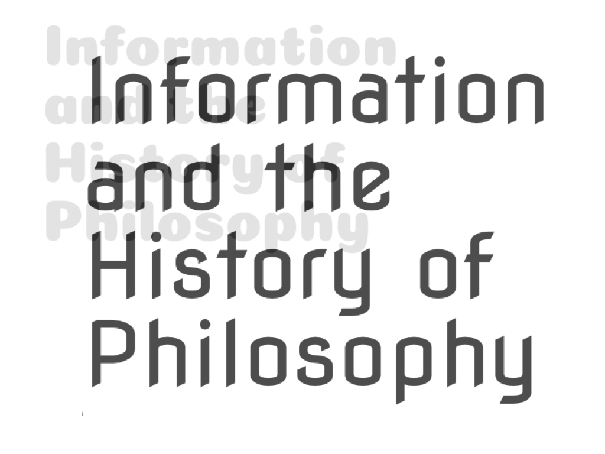

Information is everywhere around us: from tree rings, to shopping lists and quantified selves. But what exactly is information? How is it acquired, processed, or controlled? How does it shape human lives and societies? This volume offers original studies into the philosophical history of thinking about information, addressing questions regarding its metaphysics, epistemology, ethics and socio-politics. As such, the collection provides the first sustained investigation of the notion of information in the history of philosophy.

<!-- #### Contributing authors

[Monima Chadha](http://profiles.arts.monash.edu.au/monima-chadha/), [Robin Wang](http://faculty.lmu.edu/robinrwang/), [Miira Tuominen](https://www.jyu.fi/hytk/fi/laitokset/yfi/en/staff/tuominen-miira), [Chiara Thumiger](http://chiara-thumiger.net), [Luis López-Farjeat](https://www.up.edu.mx/es/profesor/18600), [Anna Akasoy](https://www.gc.cuny.edu/Page-Elements/Academics-Research-Centers-Initiatives/Master-s-Programs/Liberal-Studies/Faculty-Bios/Anna-A-Akasoy), [Nilanjan Das](http://www.dasnilanjan.com), [Cecilia Trifogli](https://www.asc.ox.ac.uk/person/71), [Lynn McDonald](https://www.gresham.ac.uk/professors-and-speakers/professor-lynn-mcdonald/), [Stina Teilmann-Lock](https://www.cbs.dk/en/research/departments-and-centres/department-of-management-politics-and-philosophy/staff/sttempp), [Richard Arthur](http://rtwarthur.com), [Edward Beasley](https://history.sdsu.edu/faculty_and_staff/faculty_bios/e_beasley.htm), [Yafeng Shan](https://yafengshan.weebly.com), [Debbie Challis](http://lse.academia.edu/DebbieChallis), [Subhadra Das](https://www.ucl.ac.uk/culture/staff/das-subhadra-1), [Renee Prendergast](https://pure.qub.ac.uk/portal/en/persons/renee-prendergast(5f4ce264-7716-40ab-8fb5-5334a172d384).html), [Reiland Rabaka](https://www.colorado.edu/ethnicstudies/people/core-faculty/reiland-rabaka), [Olimpia Lombardi](http://www.filoexactas.exactas.uba.ar/olimpia/olimpia.htm), [Cristian López](http://www.filoexactas.exactas.uba.ar/cristian/cristian.htm), [Elisabeth Nemeth](http://elisabethnemeth.com), [Rudolf Seising](https://www.deutsches-museum.de/forschung/wissenschaftl-mitarbeiter/pd-dr-rudolf-seising/), [Diane Proudfoot](https://www.canterbury.ac.nz/arts/schools-and-departments/philosophy/study-options/related-contents-contact-list/diane-proudfoot.html), [Jack Copeland](https://www.canterbury.ac.nz/arts/contact-us/people/jack-copeland.html). -->