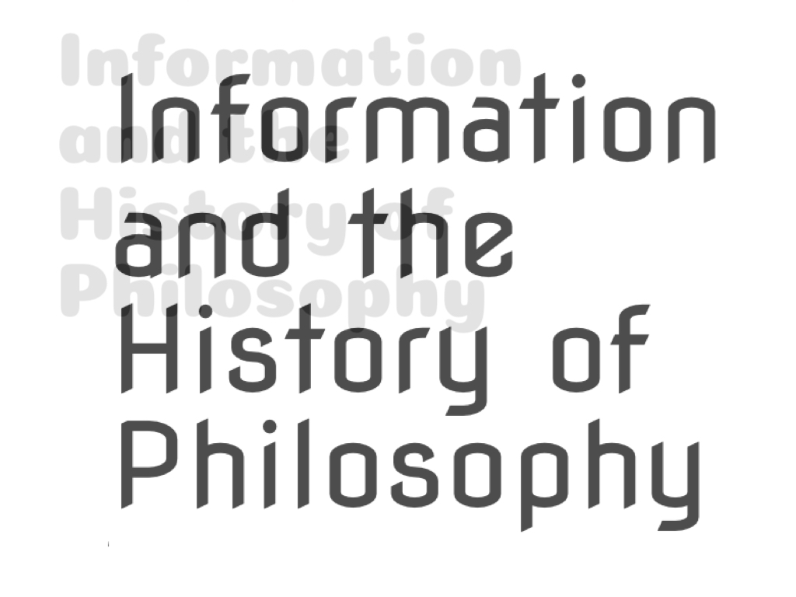

Information is everywhere around us: from tree rings, to shopping lists and quantified selves. But what exactly is information? How is it acquired, processed, or controlled? How does it shape human lives and societies? This volume offers original studies into the philosophical history of thinking about information, addressing questions regarding its metaphysics, epistemology, ethics and socio-politics. As such, the collection provides the first sustained investigation of the notion of information in the history of philosophy.

### Table of Contents

- Introduction
- [Chris Meyns](https://chrismeyns.xyz)

- **Part 1: Information before 500 CE: Natures**

- 1) Yinyang information: Order, know-how and a relation based paradigm 
- [Robin R. Wang](http://faculty.lmu.edu/robinrwang/)

- 2) Plato on the act of informing: Meaningful speech and education 
- [Tamsin de Waal](https://www.google.com/search?tbo=p&tbm=bks&q=inauthor:%22Tamsin+De+Waal%22)

- 3) On information in Aristotle: Nature, perception, knowledge
- [Miira Tuominen](https://www.su.se/english/profiles/mtuom-1.513525)

- 4) Information and history of psychiatry: The case of the disease phrenitis
- [Chiara Thumiger](chiara-thumiger.net)

- **Part 2: Information 500–1500: Access**

- 5) Vācaspati on aboutness and decomposition
- [Nilanjan Das](http://www.dasnilanjan.com/)

- 6) Seeing and recognition in the _Arabian Nights_ and Islamic Alexander legends 
- [Anna Ayse Akasoy](https://gc.cuny.edu/Faculty/Core-Bios/Anna-Akasoy)

- 7) Avicenna on information processing and abstraction
- [Luis Xavier López-Farjeat](https://www.up.edu.mx/es/profesor/18600)

- 8) Thomas Aquinas on cognition as information
- [Cecilia Trifogli](https://www.philosophy.ox.ac.uk/people/cecilia-trifogli)

- **Part 3: Information 1500–1800: Control**

- 9) Leibniz as a precursor to Chaitin’s Algorithmic Information Theory
- [Richard T. W. Arthur](https://www.humanities.mcmaster.ca/~rarthur/)

- 10) Information visualisation in the _Philosophical Transactions_
- [Chris Meyns](https://chrismeyns.xyz)

- 11) ‘Dwindled into Confusion and Nonsense’: Information in a copyright perspective from the Statute of Anne to Google Books
- [Stina Teilmann-Lock](https://www.cbs.dk/en/research/departments-and-centres/department-of-management-politics-and-philosophy/staff/sttempp)

- 12) Information in the pursuit of social reform
- [Lynn McDonald](https://en.wikipedia.org/wiki/Lynn_McDonald)

- **Part 4: Information in the nineteenth century: (Dangerous) systems**

- 13) The nineteenth-century information revolution and world peace
- [Edward Beasley](https://beasley.sdsu.edu/)

- 14) Charles Babbage’s economy of knowledge
- [Renee Prendergast](https://pure.qub.ac.uk/en/persons/renee-prendergast)

- 15) Mendel on developmental information
- [Yafeng Shan](https://www.shanyafeng.com/)

- 16) Information and eugenics: Francis Galton
- [Debbie Challis](https://www.lse.ac.uk/library/people/debbie-challis) and [Subhadra Das](https://www.ucl.ac.uk/racism-racialisation/subhadra-das)

- **Part 5: Information after 1900: Insurgencies**

- 17) The racialization of information: W.E.B. Du Bois, early intersectionality, and social information
- [Reiland Rabaka](https://www.colorado.edu/ethnicstudies/people/core-faculty/reiland-rabaka)

- 18) The many faces of Shannon information
- [Olimpia Lombardi](https://www.conicet.gov.ar/new_scp/detalle.php?keywords=olimpia%2Blombardi&id=19903&articulos=yes) and [Cristian López](https://www.conicet.gov.ar/new_scp/detalle.php?keywords=&id=46004&articulos=yes)

- 19) Computers and system(s) science—the kingpins of modern technology: Lotfi Zadeh’s glimpses into the future of the information revolution
- [Rudolf Seising](https://scholar.google.com/citations?user=YO01D9sAAAAJ)   
 
 

### Book preview

<iframe frameborder="0" scrolling="no" style="border:0px" src="https://books.google.nl/books?id=3_sqEAAAQBAJ&lpg=PP1&pg=PR4&output=embed" width=700 height=500></iframe>