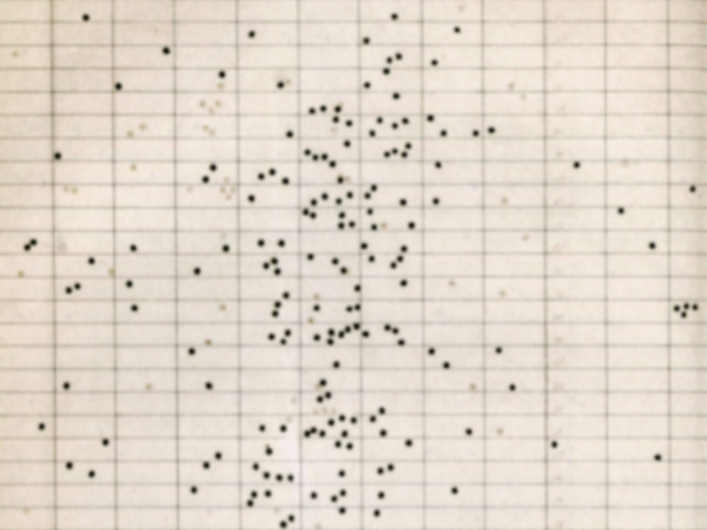

### Article abstract

This article considers the nature and function of information visualisation in one of the earliest scientific journals, the _Philosophical Transactions of the Royal Society of London_, for the period 1665-1886. It begins by giving an overview of the basic characteristics of the _Philosophical Transactions_ corpus and how visualisations occur therein. Next, it identifies and analyses three distinct types of information visualisations: the diagram, the map and the graph. On this basis, it argues that information visualisations in the early centuries of the _Philosophical Transactions_ function not to provide the reader with information of a distinct kind, but to optimise user (reader) performance.

This article is part of the volume [_Information and the History of Philosophy_]().